Indonesian Samples Vs. Controls
================
katalinabobowik
2020-09-13

Last updated: 2020-10-15

# Introduction

This part of the study will analyse differences between our Indonesian
samples and compare them with healthy controls. From my previous
analysis of healthy Indonesians, I found that Plasmodium, Flavivirus,
and Bacteria make up the majority of the taxa found within unmapped
reads. However, I want to see how different this is to populations in
more sterile environments.

The aim of this analysis is therefore to test whether the pathogen
signature identified in our Indonesian samples is unique. We will test
this by looking at the sample clustering, relative abundance of taxa,
differential abundance testing, and diversity estimates.

## About the samples

The Indonesian data in this study were generated from the
previously-published study by [Natri et
al](https://journals.plos.org/plosgenetics/article?id=10.1371/journal.pgen.1008749).
For this analysis, all RNAseq reads went through quality control using
FastQC, then leading and trailing bases below a Phred quality score of
20 and adapters were removed. The remaining reads were then mapped to
the human genome (Hg38) using STAR with a two-pass alignment.

All unmapped reads were then put through further quality control using
[KneadData](https://huttenhower.sph.harvard.edu/kneaddata/), where
tandem repeats were removed with
[TRF](https://tandem.bu.edu/trf/trf.html) and human reads were removed
with [BMtagger](https://www.westgrid.ca/support/software/bmtagger).
Finally, mapping and classification of reads was used with
[CCMetagen](https://genomebiology.biomedcentral.com/articles/10.1186/s13059-020-02014-2),
which relies upon
[KMA](https://bmcbioinformatics.biomedcentral.com/articles/10.1186/s12859-018-2336-6)
for its mapping stage.

The control samples in this study are from a study by [Tran et
al](https://www.nature.com/articles/srep31291#Tab1), conducted in 2016
and taken from a population in Mali, and by [Singhania et
al](https://www.nature.com/articles/s41467-018-04579-w), conducted in
2018 and taken from the UK.

The samples in the Tran et al study were whole blood samples from 54
healthy Malian individuals and sequeneced on an Illumina HiSeq 2000.
Whole blood was then depleted of rRNA and globin RNA before
amplification using the ScriptSeq Complete Gold Kit (Illumina).

For the Singhania et al study, whole blood was taken from 10 healthy
individuals from London in the United Kingdom. Whole blood was
globin-depleted using the human GLOBINclear kit (Thermo Fisher
Scientific) and sequenced on an Illumina HiSeq 4000.

Both control datasets went through the same pipeline as the Indonesian
dataset, however since the Singhania et al data is 75-bp, both the
Malian and Indonesian dataset were trimmed to 75BP.

Therefore, this part of the analysis uses 75-BP, single-ended data from
whole blood, taken from three different populations.

# Loading packages and colour setup

The code below will install the packages needed to run the analysis.
We’re also setting up our directories to run locally, but I’ve
provided all of the paths so they can be easily modified if they need to
be run on the server.

``` r
require(ggplot2)
require(RColorBrewer)
library(dplyr)
library(plyr)
library(reshape2)
library(ggpubr)
library(metacoder)
library(tidyverse)             
library(phyloseq)                   
library(DESeq2)                       
library(microbiome)               
library(vegan)                         
library(picante)                     
library(ALDEx2)                      
library(metagenomeSeq)          
library(HMP)                             
library(dendextend)               
library(selbal)                       
library(rms)
library(breakaway)        
library(microbiomeutilities)
library(mixOmics)
library(SRS)
library(ggrepel)
library(DivNet)

# set up directories
refdir = "/Users/katalinabobowik/Documents/UniMelb_PhD/Analysis/UniMelb_Sumba/ReferenceFiles/EpiStudy/"
filteringDir = "/Users/katalinabobowik/Documents/UniMelb_PhD/Analysis/UniMelb_Sumba/Output/Epi_Study/ControlSampleComparison/"
```

We’ll also set up our colour schemes.

``` r
# set ggplot colour theme to white
theme_set(theme_bw())

# Set up colour schemes
IndonesiaCol="#4477AA"
MaliCol="#228833"
UKCol="#AA3377"
```

# Reading in the Indonesian data

Many microbiome studies use the package
[phyloseq](https://github.com/joey711/phyloseq) to analyse data due to
its comprehensive packages. The data structures in phyloseq (taxa data,
otu data, and sample data) are also contained in a single object, which
makes it easy to keep everything together.

First, we’ll read in our Indonesian single-ended count data and convert
taxa and read abundance information into a phyloseq object. We’ll then
assign sample information to the phyloseq object so that we can compare
it to the control
datasets.

``` r
AllREadsSE_Indo_Counts <- read.csv(paste0(refdir,"Counts_Indo_75BP_SE.csv"),check.names=FALSE)

# Separate species' abundances and taxonomy columns
taxa_raw <- as.matrix(AllREadsSE_Indo_Counts[,c("Superkingdom","Kingdom","Phylum", "Class", "Order","Family","Genus","Species")])
abund_raw <- as.matrix(AllREadsSE_Indo_Counts[,-which(colnames(AllREadsSE_Indo_Counts) %in% c("Superkingdom","Kingdom","Phylum", "Class", "Order","Family","Genus","Species"))])

# convert to Phyloseq object
tax = tax_table(taxa_raw)
taxa = otu_table(abund_raw, taxa_are_rows = TRUE)
AllREadsSE_Indo_Counts_physeq = phyloseq(taxa, tax)

# add in sample information, starting with Island
samplenames <- colnames(otu_table(AllREadsSE_Indo_Counts_physeq))
pop <- rep("Indonesia",ncol(otu_table(AllREadsSE_Indo_Counts_physeq)))

# make this into a df and add to the Phloseq object
samples_df=data.frame(SampleName=colnames(otu_table(AllREadsSE_Indo_Counts_physeq)), SamplePop=pop)
samples = sample_data(samples_df)
rownames(samples)=samples$SampleName
sample_data(AllREadsSE_Indo_Counts_physeq) <- samples

# get information on phyloseq objects
AllREadsSE_Indo_Counts_physeq
```

    ## phyloseq-class experiment-level object
    ## otu_table()   OTU Table:         [ 2458 taxa and 123 samples ]
    ## sample_data() Sample Data:       [ 123 samples by 2 sample variables ]
    ## tax_table()   Taxonomy Table:    [ 2458 taxa by 8 taxonomic ranks ]

For the Indonesian samples, we can see that we have a phyloseq object
consisting of 123 samples, 6 of which are replicates. We’ll take the
replicates with the highest library depth and then remove the rest.

``` r
# get replicates
trimmed_samplenames = gsub("Batch1",'',samplenames) %>% gsub("Batch2",'', .) %>% gsub("Batch3",'', .)
trimmed_samplenames = sub("([A-Z]{3})([0-9]{3})", "\\1-\\2", trimmed_samplenames)
replicate_index = which(duplicated(trimmed_samplenames) | duplicated(trimmed_samplenames, fromLast = TRUE))
replicates = samplenames[replicate_index]

# add sequencing depth information to the Physeq object in order to filter replicates by seqDepth
SeqDepth = colSums(otu_table(AllREadsSE_Indo_Counts_physeq))
sample_data(AllREadsSE_Indo_Counts_physeq)$SeqDepth = SeqDepth

# find out which replicates have the highest sequencing depth
sample_data(AllREadsSE_Indo_Counts_physeq)[replicates,]
```

    ##                          SampleName SamplePop SeqDepth
    ## MPI-381Batch1         MPI-381Batch1 Indonesia    31097
    ## MPI-381Batch3         MPI-381Batch3 Indonesia    35468
    ## MTW-TLL-013Batch2 MTW-TLL-013Batch2 Indonesia    42231
    ## MTW-TLL013Batch3   MTW-TLL013Batch3 Indonesia    37580
    ## SMB-ANK-016Batch2 SMB-ANK-016Batch2 Indonesia   111419
    ## SMB-ANK-027Batch1 SMB-ANK-027Batch1 Indonesia    39086
    ## SMB-ANK-027Batch2 SMB-ANK-027Batch2 Indonesia    46355
    ## SMB-ANK016Batch3   SMB-ANK016Batch3 Indonesia    27387
    ## SMB-ANK027Batch3   SMB-ANK027Batch3 Indonesia    48014
    ## SMB-WNG-021Batch1 SMB-WNG-021Batch1 Indonesia    53616
    ## SMB-WNG021Batch3   SMB-WNG021Batch3 Indonesia    35954

``` r
replicateDF=as.data.frame(sample_data(AllREadsSE_Indo_Counts_physeq)[replicates,])
replicateDF$SampleName = sub("([A-Z]{3})([0-9]{3})", "\\1-\\2", replicateDF$SampleName)
replicateDF$SampleName = gsub("Batch1",'',replicateDF$SampleName) %>% gsub("Batch2",'', .) %>% gsub("Batch3",'', .)
replicateDF=replicateDF[with(replicateDF, order(-SeqDepth)), ]
removeReplicates=rownames(replicateDF[which(duplicated(replicateDF$SampleName)),])
keepReplicates=rownames(sample_data(AllREadsSE_Indo_Counts_physeq))[-which(rownames(sample_data(AllREadsSE_Indo_Counts_physeq)) %in% removeReplicates)]

# prune these out
AllREadsSE_Indo_Counts_physeq=prune_samples(keepReplicates,AllREadsSE_Indo_Counts_physeq)

# remove taxa with only 0's in the phyloseq object
any(taxa_sums(AllREadsSE_Indo_Counts_physeq) == 0)
```

    ## [1] TRUE

``` r
AllREadsSE_Indo_Counts_physeq=prune_taxa(taxa_sums(AllREadsSE_Indo_Counts_physeq) > 0, AllREadsSE_Indo_Counts_physeq)

# add sequencing depth information
SeqDepth_Prefilter = colSums(otu_table(AllREadsSE_Indo_Counts_physeq))
sample_data(AllREadsSE_Indo_Counts_physeq)$SeqDepth_Prefilter = SeqDepth_Prefilter

AllREadsSE_Indo_Counts_physeq
```

    ## phyloseq-class experiment-level object
    ## otu_table()   OTU Table:         [ 2391 taxa and 117 samples ]
    ## sample_data() Sample Data:       [ 117 samples by 4 sample variables ]
    ## tax_table()   Taxonomy Table:    [ 2391 taxa by 8 taxonomic ranks ]

We now have a phyloseq object of 117 samples and 2,391 taxa.

# Reading in the control datasets

The first control dataset we’ll read in is from a study conducted by
[Tran et al](https://www.nature.com/articles/srep31291#Tab1), conducted
in 2016. This study looked at transcriptomic differences between
individuals pre and post (natural) infection with P. falciparum. We’ll
only be using the healthy samples pre-infection, of which there are 54.

One of the reasons why this dataset is interesting is becase it comes
from individuals living in areas that have a high pathogen load, similar
to our study. Therefore, we can compare how our data looks like to
another population that lives in an area with a high rate of endemic
malaria and high pathogen load.

Let’s read in the data, make it into a PhyloSeq object, and add in our
sample
information.

## Malian Samples

``` r
Mali_Counts <- read.csv(paste0(refdir,"MaliControls_Counts_NoFilter_75BP.csv"),check.names=FALSE)

# Separate species' abundances and taxonomy columns
taxa_raw <- as.matrix(Mali_Counts[,c("Superkingdom","Kingdom","Phylum", "Class", "Order","Family","Genus","Species")])
abund_raw <- as.matrix(Mali_Counts[,-which(colnames(Mali_Counts) %in% c("Superkingdom","Kingdom","Phylum", "Class", "Order","Family","Genus","Species"))])
# convert to Phyloseq object
tax = tax_table(taxa_raw)
taxa = otu_table(abund_raw, taxa_are_rows = TRUE)
Mali_Counts_physeq = phyloseq(taxa, tax)

# add in sample information, i.e., the sample names and population they're from
samplenames <- colnames(otu_table(Mali_Counts_physeq))
pop <- rep("Mali",ncol(otu_table(Mali_Counts_physeq)))

# make this into a df and add to the Phloseq object
samples_df=data.frame(SampleName=colnames(otu_table(Mali_Counts_physeq)), SamplePop=pop)
samples = sample_data(samples_df)
rownames(samples)=samples$SampleName
sample_data(Mali_Counts_physeq) <- samples

# add sequencing depth information 
SeqDepth_Prefilter = colSums(otu_table(Mali_Counts_physeq))
sample_data(Mali_Counts_physeq)$SeqDepth_Prefilter = SeqDepth_Prefilter

# summarise data
Mali_Counts_physeq
```

    ## phyloseq-class experiment-level object
    ## otu_table()   OTU Table:         [ 3355 taxa and 54 samples ]
    ## sample_data() Sample Data:       [ 54 samples by 3 sample variables ]
    ## tax_table()   Taxonomy Table:    [ 3355 taxa by 8 taxonomic ranks ]

We now have a phyloseq object of 54 samples by 3355 taxa.

## European samples

The next set of control samples is from a study conducted by [Singhania
et al](https://www.nature.com/articles/s41467-018-04579-w) in 2018. This
study was conducted on whole blood of tubercolosis (TB) and latent-(TB)
patients to distinguish between active and asymptomatic TB infection,
however the samples used for this analysis are all healthy controls.

As with the other studies, we’ll first convert the data to a phyloseq
object.

``` r
European_Counts <- read.csv(paste0(refdir,"TBControls_NoFiltering_Counts.csv"),check.names=FALSE)

# Separate species' abundances and taxonomy columns
taxa_raw <- as.matrix(European_Counts[,c("Superkingdom","Kingdom","Phylum", "Class", "Order","Family","Genus","Species")])
abund_raw <- as.matrix(European_Counts[,-which(colnames(European_Counts) %in% c("Superkingdom","Kingdom","Phylum", "Class", "Order","Family","Genus","Species"))])
# convert to Phyloseq object
tax = tax_table(taxa_raw)
taxa = otu_table(abund_raw, taxa_are_rows = TRUE)
European_Counts_physeq = phyloseq(taxa, tax)

# add in sample information, i.e., the sample names and population they're from
samplenames <- colnames(otu_table(European_Counts_physeq))
pop <- rep("UK",ncol(otu_table(European_Counts_physeq)))

# make this into a df and add to the Phloseq object
samples_df=data.frame(SampleName=colnames(otu_table(European_Counts_physeq)), SamplePop=pop)
samples = sample_data(samples_df)
rownames(samples)=samples$SampleName
sample_data(European_Counts_physeq) <- samples

# add sequencing depth information 
SeqDepth_Prefilter = colSums(otu_table(European_Counts_physeq))
sample_data(European_Counts_physeq)$SeqDepth_Prefilter = SeqDepth_Prefilter

# get phyloseq summary information
European_Counts_physeq
```

    ## phyloseq-class experiment-level object
    ## otu_table()   OTU Table:         [ 1026 taxa and 10 samples ]
    ## sample_data() Sample Data:       [ 10 samples by 3 sample variables ]
    ## tax_table()   Taxonomy Table:    [ 1026 taxa by 8 taxonomic ranks ]

We now have a phyloseq object of 10 samples with 1026 taxa.

# Merging the data

The next step is to merge the Indonesian and control datasets together.
Phyloseq makes this relatively easy with its function merge\_phyloseq().

HOWEVER, there is a caveat to this: although the [merge\_phyloseq
function](https://www.rdocumentation.org/packages/phyloseq/versions/1.16.2/topics/merge_phyloseq)
says that it merges by ‘first separating higher-order objects into a
list of their component objects; then, merging any component objects of
the same class into one object’, this is not the case (for my data,
anyhow)\!\! I’m not the only one who [had this
problem](https://github.com/joey711/phyloseq/issues/574), so in the end,
the solution is to give each taxa name a unique ID, which in this case,
is the species name (the most specific name). We’ll then make sure that
our phyloseq objects from above (before merging) are the same as after
we merge.

``` r
# assign unique taxa names to all phyloseq objects
taxa_names(AllREadsSE_Indo_Counts_physeq) <- paste(tax_table(AllREadsSE_Indo_Counts_physeq)[,"Superkingdom"], tax_table(AllREadsSE_Indo_Counts_physeq)[,"Kingdom"], tax_table(AllREadsSE_Indo_Counts_physeq)[,"Phylum"], tax_table(AllREadsSE_Indo_Counts_physeq)[,"Class"], tax_table(AllREadsSE_Indo_Counts_physeq)[,"Order"], tax_table(AllREadsSE_Indo_Counts_physeq)[,"Family"], tax_table(AllREadsSE_Indo_Counts_physeq)[,"Genus"], tax_table(AllREadsSE_Indo_Counts_physeq)[,"Species"], sep="_")
taxa_names(Mali_Counts_physeq) <- make.unique(paste(tax_table(Mali_Counts_physeq)[,"Superkingdom"], tax_table(Mali_Counts_physeq)[,"Kingdom"], tax_table(Mali_Counts_physeq)[,"Phylum"], tax_table(Mali_Counts_physeq)[,"Class"], tax_table(Mali_Counts_physeq)[,"Order"], tax_table(Mali_Counts_physeq)[,"Family"], tax_table(Mali_Counts_physeq)[,"Genus"], tax_table(Mali_Counts_physeq)[,"Species"], sep="_"))
taxa_names(European_Counts_physeq) <- make.unique(paste(tax_table(European_Counts_physeq)[,"Superkingdom"], tax_table(European_Counts_physeq)[,"Kingdom"], tax_table(European_Counts_physeq)[,"Phylum"], tax_table(European_Counts_physeq)[,"Class"], tax_table(European_Counts_physeq)[,"Order"], tax_table(European_Counts_physeq)[,"Family"], tax_table(European_Counts_physeq)[,"Genus"], tax_table(European_Counts_physeq)[,"Species"], sep="_"))
merged_phylo_counts=merge_phyloseq(AllREadsSE_Indo_Counts_physeq, Mali_Counts_physeq, European_Counts_physeq)

# subset populations
Indonesian_subset <- phyloseq::subset_samples(merged_phylo_counts, SamplePop == "Indonesia")
Mali_subset <- phyloseq::subset_samples(merged_phylo_counts, SamplePop == "Mali")
UK_subset <- phyloseq::subset_samples(merged_phylo_counts, SamplePop == "UK")

# define function to check if both objects are identical
is.identical <- function(pop_to_subset, original_phyloseq_obj){
    pruned_pop_subset <- prune_taxa(taxa_sums(pop_to_subset) > 0, pop_to_subset)
    merged_df=merge(as.data.frame(otu_table(pruned_pop_subset)), as.data.frame(otu_table(original_phyloseq_obj)),by=0)
    nsamples=ncol(otu_table(pruned_pop_subset))
    merged_df[,"Row.names"] <- NULL
    colnames(merged_df)=rep("Rep",ncol(merged_df))
    is.identical <- identical(merged_df[,1:nsamples],merged_df[,(nsamples+1):ncol(merged_df)])
    return(is.identical)
}

is.identical(pop_to_subset=Indonesian_subset, original_phyloseq_obj=AllREadsSE_Indo_Counts_physeq)
```

    ## [1] TRUE

``` r
is.identical(pop_to_subset=Mali_subset, original_phyloseq_obj=Mali_Counts_physeq)
```

    ## [1] TRUE

``` r
is.identical(pop_to_subset=UK_subset, original_phyloseq_obj=European_Counts_physeq)
```

    ## [1] TRUE

They’re all the same, so we can move forward.

# Data processing

## Removing singletons from the data

The easiest way to get rid of some error in your data is to throw out
any count information below some threshold. Oddly, in microbiomics,
there’s no set thresholding for this. In the end, it’s really a
compromise between accuracy and keeping rare taxa. What *is* decided is
that filtering out at least singletons is standard, since these are
regarded as sources of error or contamination. Some resources I found
that were helpful on this can be found
[here](http://drive5.com/usearch/manual/singletons.html) and
[here](https://forum.qiime2.org/t/do-you-guys-still-remove-singletons-or-doubletons-these-days/7138/2).

In most of the datasets, we can see that there’s a high number of low
counts within the data.

``` r
# histogram of data
ggplot(meta(merged_phylo_counts)) + geom_histogram(aes(x = SeqDepth_Prefilter), alpha= 0.6, bins=100) + facet_wrap(~SamplePop)
```

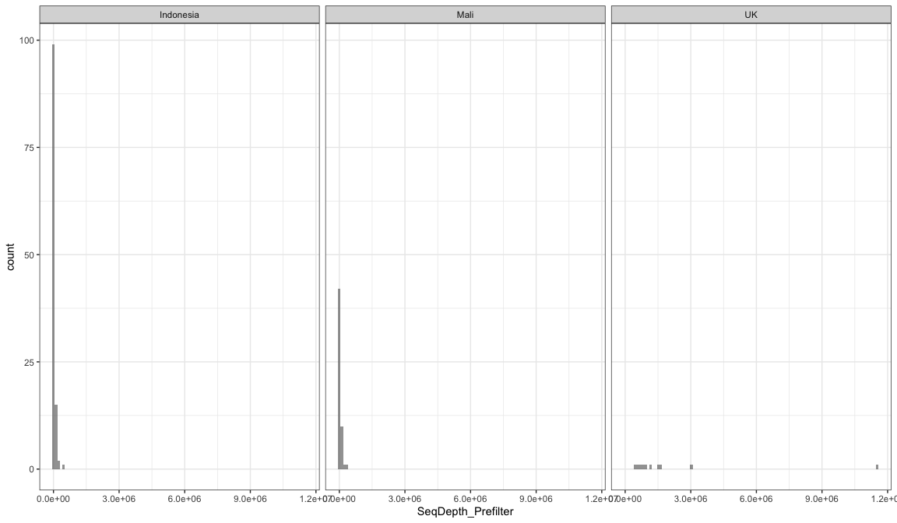

With a higher sequencing depth, you can afford to play around with
thresholding, however for the Indonesian dataset, the sequencing depth
is variable and quite low in some samples. Therefore, pushing this
threshold up too high will eliminate rare taxa, especially given that we
didn’t have a high library size to begin with.

Although our starting library size is small, let’s explore the data a
bit by looking at the effect of removing singletons.

A great tool to do this is raraefaction curves. Rarefaction curves are
commonly used in microbiomics to estimate 1) species richness and 2)
determine how extensively a library was sampled. For the first point,
it’s nearly impossible to capture all species within a community, and
therefore this allows for a way to estimate the total number of species
we would expect to find by extrapolating the curve within the
rarefaction plot. A rarefaction curve will (if sampled to a high enough
depth) asymptote, and this point is regarded as the estimate of the
total number of species within that community.

For the second point, we can also use the asymptote of the curve to see
how extensively we sampled. If the curve has not started to flatten off,
we have not captured everything.

Lets see how rarefaction looks like when we remove singletons and when
we remove counts 5 and below.

``` r
# Separate species' abundances and taxonomy columns
rarecurve_counts <- otu_table(merged_phylo_counts)
col <- c(rep(IndonesiaCol,sum(sample_data(merged_phylo_counts)[,"SamplePop"]=="Indonesia")),rep(MaliCol,sum(sample_data(merged_phylo_counts)[,"SamplePop"]=="Mali")),rep(UKCol,sum(sample_data(merged_phylo_counts)[,"SamplePop"]=="UK")))
# Try with different filtering thresholds:
for (i in c(1,5)){
    rarecurve_counts[rarecurve_counts<=i]<-0
    rarecurve(t(otu_table(rarecurve_counts, taxa_are_rows = TRUE)), step=200, col=col,label=F, xlab="Counts",ylab="Number Species",main=paste("Removing Reads",i,"And Below",sep=" "),xlim=c(0,50000))
}

# Rarefaction curves for the Indonesian dataset only (since it is lower sequencing depth and hard to see)
Indonesian_subset <- prune_taxa(taxa_sums(Indonesian_subset) > 0, Indonesian_subset)
rarecurve_counts <- otu_table(Indonesian_subset)
col <- IndonesiaCol
for (i in c(1,5)){
    rarecurve_counts[rarecurve_counts<=i]<-0
    rarecurve(t(otu_table(rarecurve_counts, taxa_are_rows = TRUE)), step=200, col=col,label=F, xlab="Counts",ylab="Number Species",main=paste("Removing Reads",i,"And Below \nIndonesian Samples",sep=" "),xlim=c(0,10000))
}
```

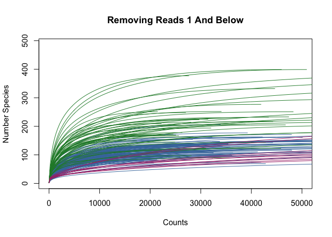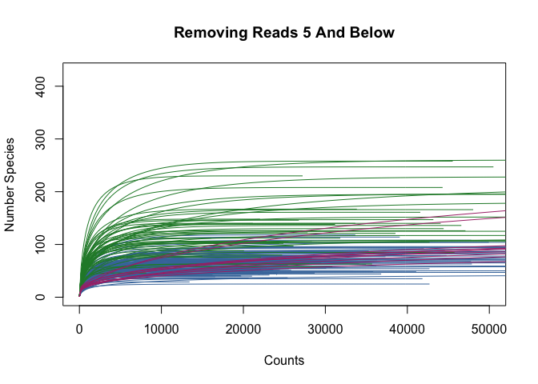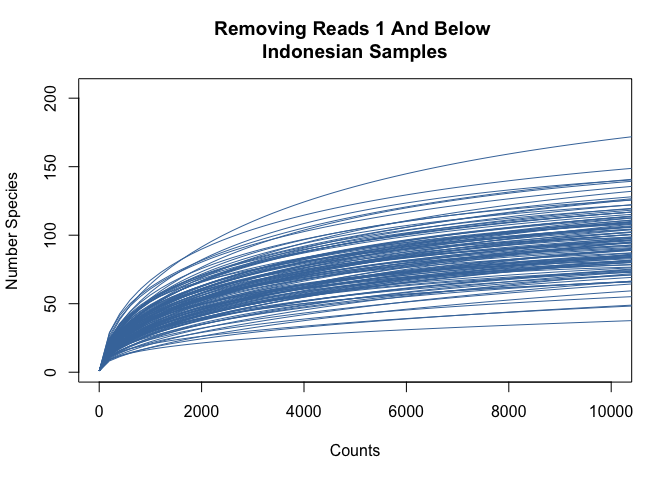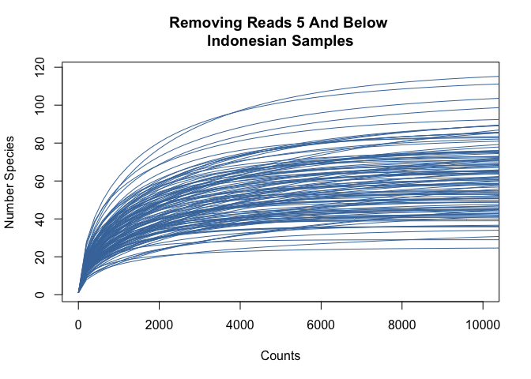

From the rarefaction curves, we can notice a few things. For one, the
library size needed to capture all of the taxa is quite variable between
studies and individuals. For example, some samples in the Indonesian
study are not very diverse and don’t need that many reads to capture all
of the taxa (\<5,000). In contrast to this, the Malian study (in green)
is the most diverse, with over 20,000 reads necessary to capture the
full diversity in some samples.

We might also notice that when removing reads 5 and below (shown on the
right hand side), the curve asymptotes much sooner. This is because you
need more reads to detect rare species, and therefore removing reads 5
and below eliminates some of these rare species.

As mentioned before, because our starting read depth is small, we will
stick with removing singletons. We will also add the sequencing depth
information to the phyloseq object to keep track of oir library size
after filtering.

``` r
# Filter out singletons
otu_table(merged_phylo_counts)[otu_table(merged_phylo_counts)<=1]<-0
merged_phylo_counts <- prune_taxa(taxa_sums(merged_phylo_counts) > 0, merged_phylo_counts)
# add sequencing depth information after filtering out singletons
SeqDepth_noSingletons = colSums(otu_table(merged_phylo_counts))
sample_data(merged_phylo_counts)$SeqDepth_noSingletons = SeqDepth_noSingletons
```

## Removing humans and plants

From the script ‘RemovingViridiplantaeAndMetazoa.R’, we saw that human
reads and viridiplantae are not of interest and we want to filter these
out. When we do this, we’ll also keep track of hom many reads we’re
filtering out after each step.

``` r
# Filter out Viridiplantae 
merged_phylo_counts <- subset_taxa(merged_phylo_counts, (Kingdom!="Viridiplantae"))
merged_phylo_counts <- prune_taxa(taxa_sums(merged_phylo_counts) > 0, merged_phylo_counts)
# add sequencing depth information after filtering out plants
SeqDepth_noViridiplantae = colSums(otu_table(merged_phylo_counts))
sample_data(merged_phylo_counts)$SeqDepth_noViridiplantae = SeqDepth_noViridiplantae

# Filter out Chordata
merged_phylo_counts <- subset_taxa(merged_phylo_counts, (Phylum!="Chordata"))
merged_phylo_counts <- prune_taxa(taxa_sums(merged_phylo_counts) > 0, merged_phylo_counts)
# add sequencing depth information after filtering out Metazoa
SeqDepth_noChordata = colSums(otu_table(merged_phylo_counts))
sample_data(merged_phylo_counts)$SeqDepth_noChordata = SeqDepth_noChordata

# Filter out Metazoa
merged_phylo_counts <- subset_taxa(merged_phylo_counts, (Kingdom!="Metazoa"))
merged_phylo_counts <- prune_taxa(taxa_sums(merged_phylo_counts) > 0, merged_phylo_counts)
# add sequencing depth information after filtering out Metazoa
SeqDepth_noMetazoa = colSums(otu_table(merged_phylo_counts))
sample_data(merged_phylo_counts)$SeqDepth_noMetazoa = SeqDepth_noMetazoa
```

## Summarising the data

Now that we’ve done all of the filtering, we can plot the final library
sizes.

``` r
# barplot of library sizes
ggplot(meta(merged_phylo_counts), aes(SampleName, SeqDepth_noMetazoa)) + geom_bar(stat = "identity", aes(fill = SamplePop)) +
scale_fill_manual(values = c(IndonesiaCol,MaliCol,UKCol)) + rotate_x_text()
```

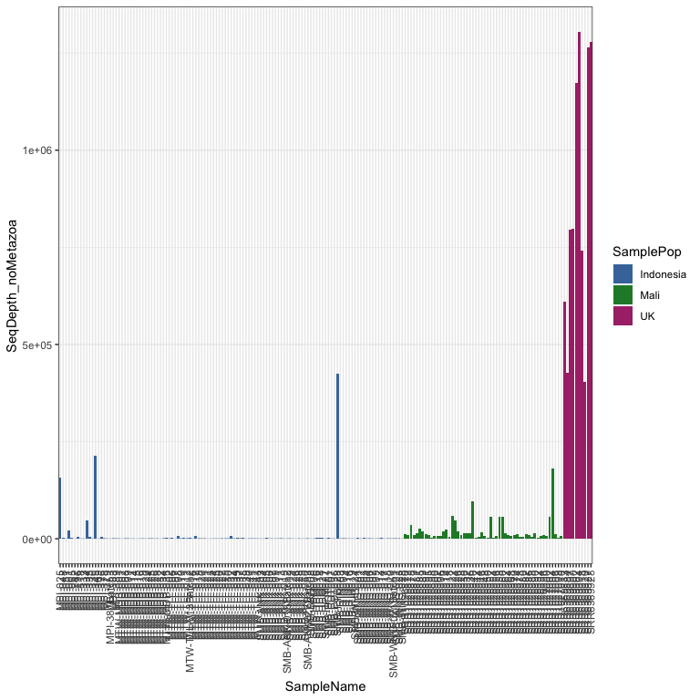

We can see that the library sizes are highly uneven, with the Indonesian
data having the lowest sampling depth (with the exception of a few
samples) and the UK dataset having the highest library depth.

The final step us is to summarise the data and see how many reads we
lost at each filtering
step.

``` r
FilteringSummary = sample_data(merged_phylo_counts)[,c("SamplePop","SeqDepth_Prefilter","SeqDepth_noSingletons","SeqDepth_noViridiplantae","SeqDepth_noChordata","SeqDepth_noMetazoa")]

# melt df and plot
melted_FilteringSummary = melt(FilteringSummary)
ggplot(melted_FilteringSummary, aes(x=variable, y=value, fill=SamplePop)) +
  geom_violin(alpha=0.8) + theme_bw() + ylab("Spearman pairwise correlation") +
  theme(axis.title.x=element_blank(), axis.text.x = element_text(angle = 90)) + scale_fill_manual(values = c(IndonesiaCol,MaliCol,UKCol)) +
  geom_boxplot(color="black",width=0.2, alpha = 0.7) + facet_wrap(~ SamplePop, scales = "free")
```

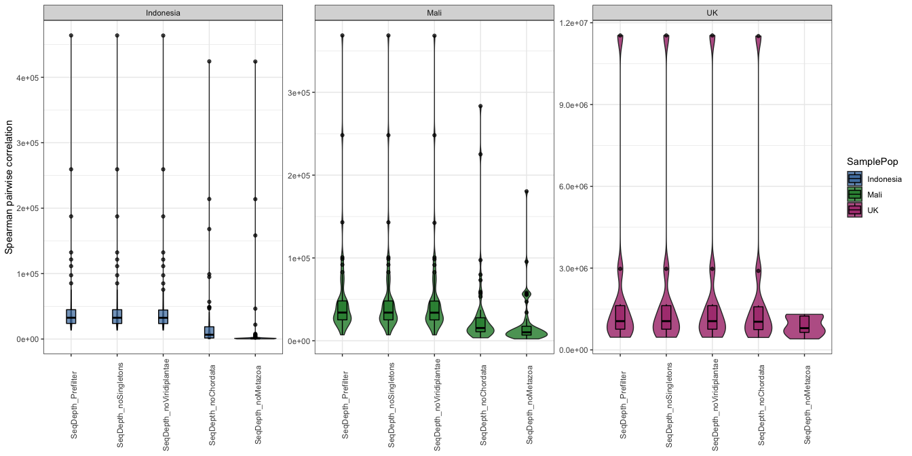

We can see that in the Indonesian and Malian dataset, most of the reads
are removed when removing Chordates, however for the UK dataset, most
reads are removed when removing Metazoa. For the UK dataset, this is due
to a high number of reads mapping to molluscs, as I discuss in my script
‘RemovingViridiplantaeAndMetazoa.R’.

# Data normalisation

The library sizes between samples and groups is highly variable, and
therefore comparing the data to each other will result in biased
results.

There are two ways of handling this: 1. Performing a transformation of
the data or 2. rarefying the data.

Rarefaction is performed by drawing reads without replacement from each
sample so that all samples have the same number of total counts. This
process standardizes the library size across samples and is especially
important for calulating diversity metrics, where read depth influences
microbe diversity.

From what I’ve found, many people in the microbiomics community have
very strong opinions about rarefying data. Some camps, such as QIIME,
think that it’s just fine, whereas others, such as the creators of
Phyloseq, strongly advise against it. A seminal, and of the most
well-referenced papers about the disadvantages of rarefying data, was
published in 2014 by [McMurdie &
Holmes](https://journals.plos.org/ploscompbiol/article?id=10.1371/journal.pcbi.1003531).
The arguments they have echo the main concerns seen within the
‘anti-rarefy’ camps: namely that rarefying data 1) decreases the
ability to detect rare taxa and 2) can lead to unequally-rarefied data
due to rare taxa being over or underrepresented in libraries normalised
to a small size.

The overall consesnus I’ve found about rarefaction is that it should be
avoided when possible. Therefore, we’ll be using transformations of the
data instead to correct for uneven sequencing depth.

## Centered log-ration transformation

Taxa can be viewed by their relative abundance, however changes in the
abundance of one taxon will result in changing the abundance of other
taxa.

One of the ways to handle this is to transform the data using Centered
Log Ratio (CLR) transformation. CLR data shows how OTUs behave relative
to the per-sample average and is a commonly-used data transformation
method in microbiomics.

Another cool thing about using CLR-transformed data is that it is not
affected by sequencing depth. This excerpt from a paper by [Gloor et
al](https://www.ncbi.nlm.nih.gov/pmc/articles/PMC5695134/) explains this
really well:

“The clr-transformed values are scale-invariant; that is the same ratio
is expected to be obtained in a sample with few read counts or an
identical sample with many read counts, only the precision of the clr
estimate is affected. This is elaborated in the “Probability” and
“Log-ratio transformations” section in the Supplement, but the
consequence is that count normalization is unnecessary and indeed,
undesirable since information on precision is lost."

Unfortunately, one of the disadvantages to using CLR-transformed data is
that it can’t be used in diversity estimates, and it’s also hard to
visualise.

Becasue CLR data is an informative measure of our data, I’ll first
explore sample grouping using this method.

The first step to performing a CLR transformation on the data is to add
an offset of 1 to the counts. This is necessary, since performing a log
on 0 values is undefined. We’ll then perform a log ratio transformation
of the data using the mixOmics package.

``` r
offset_otu=otu_table(merged_phylo_counts)+1
transform_counts=t(otu_table(offset_otu))
data_clr <- logratio.transfo(as.matrix(transform_counts), logratio = 'CLR', offset = 0) 
```

### Sample grouping

Now that we’ve transformed our data, we can make a PCA plot to see how
each sample clusters. The current obect we have is a CLR-class object.
You can plot this type of data object easily with mixOmics, however I
prefer the visualisation that phyloseq offers (you can’t alter the PCA
plots that much in mixOmics). So, we’ll turn the clr object back into a
phyloseq object and make an ordination plot of the data.

\!Note: When Euclidean distances are used in PCoA plots, it is
[equivalent to a PCA plot](http://ordination.okstate.edu/overview.htm).

``` r
# Make a duplicated phyloseq object to use for plotting
class(data_clr)="matrix"
taxa = otu_table(t(data_clr), taxa_are_rows = TRUE)
merged_phylo_counts_clr=merged_phylo_counts
otu_table(merged_phylo_counts_clr)=taxa

out.wuf.log <- ordinate(merged_phylo_counts_clr, method = "PCoA", distance = "euclidean")
plot_ordination(merged_phylo_counts_clr, out.wuf.log, color="SamplePop", axes = 1:2, label="SampleName") + scale_colour_manual(values=c(IndonesiaCol,MaliCol,UKCol))
```

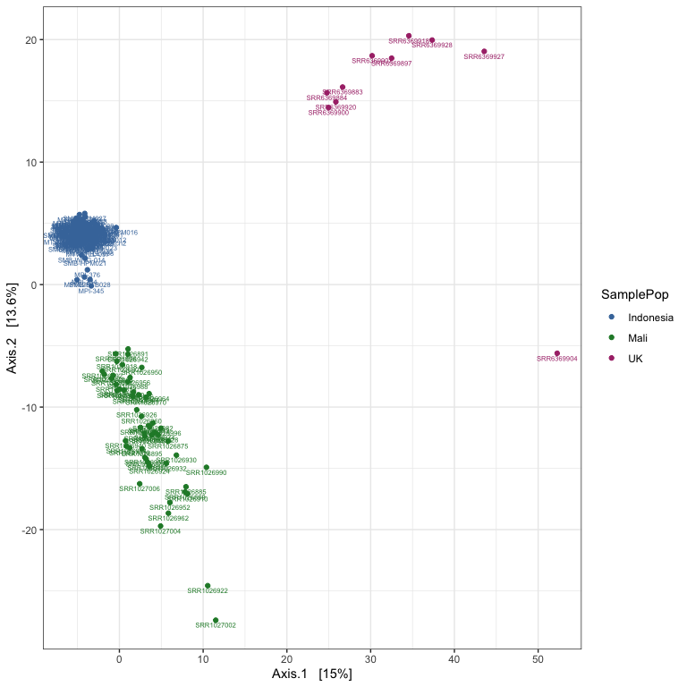
We can see that the first principal component is separating the three
studies apart, however there is a clear outlier in the UK population -
SRR6369904. We can see this even more clearly in the third
PC.

``` r
plot_ordination(merged_phylo_counts_clr, out.wuf.log, color="SamplePop", axes = 2:3, label="SampleName") + scale_colour_manual(values=c(IndonesiaCol,MaliCol,UKCol))
```


We will therefore remove this outlier sample from the analysis.

``` r
# First remove this sample from merged_counts dataset
merged_phylo_counts <- subset_samples(merged_phylo_counts, SampleName != "SRR6369904")
any(taxa_sums(merged_phylo_counts) == 0)
```

    ## [1] TRUE

``` r
merged_phylo_counts <- prune_taxa(taxa_sums(merged_phylo_counts) > 0, merged_phylo_counts)
any(taxa_sums(merged_phylo_counts) == 0)
```

    ## [1] FALSE

``` r
# then redo clr-transformation of the data
offset_otu=otu_table(merged_phylo_counts)+1
transform_counts=t(otu_table(offset_otu))
data_clr <- logratio.transfo(as.matrix(transform_counts), logratio = 'CLR', offset = 0) 
# Make a duplicated phyloseq object to use for plotting
class(data_clr)="matrix"
taxa = otu_table(t(data_clr), taxa_are_rows = TRUE)
merged_phylo_counts_clr=merged_phylo_counts
otu_table(merged_phylo_counts_clr)=taxa
```

After removing this sample, let’s check the library sizes for each of
our populations.

``` r
table(sample_data(merged_phylo_counts)[,"SamplePop"])
```

    ## 
    ## Indonesia      Mali        UK 
    ##       117        54         9

We now have 117 Indonesian samples, 54 Malian samples, and 9 UK samples.

Now we can replot the data. Let’s have a look at the first five PCs to
explore the
data.

``` r
out.wuf.log <- ordinate(merged_phylo_counts_clr, method = "PCoA", distance = "euclidean")
plot_ordination(merged_phylo_counts_clr, out.wuf.log, color="SamplePop", axes = 1:2, label="SampleName") + scale_colour_manual(values=c(IndonesiaCol,MaliCol,UKCol))
```

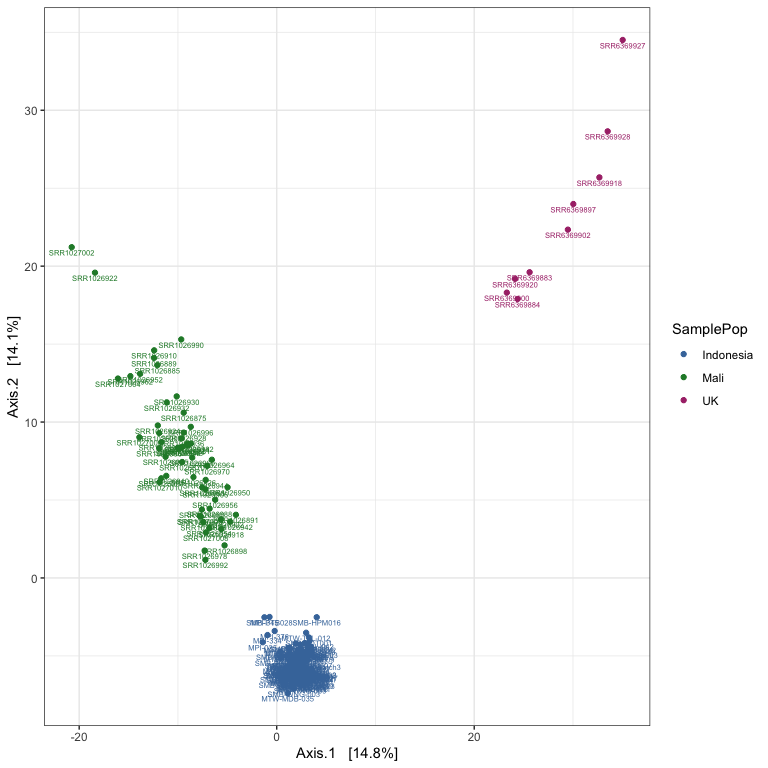

``` r
plot_ordination(merged_phylo_counts_clr, out.wuf.log, color="SamplePop", axes = 2:3, label="SampleName") + scale_colour_manual(values=c(IndonesiaCol,MaliCol,UKCol))
```

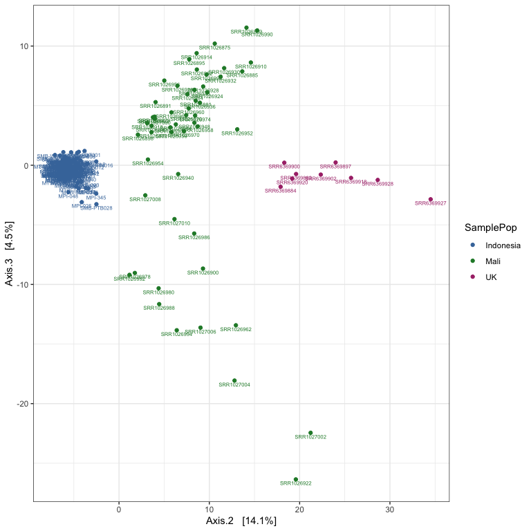

``` r
plot_ordination(merged_phylo_counts_clr, out.wuf.log, color="SamplePop", axes = 3:4, label="SampleName") + scale_colour_manual(values=c(IndonesiaCol,MaliCol,UKCol))
```

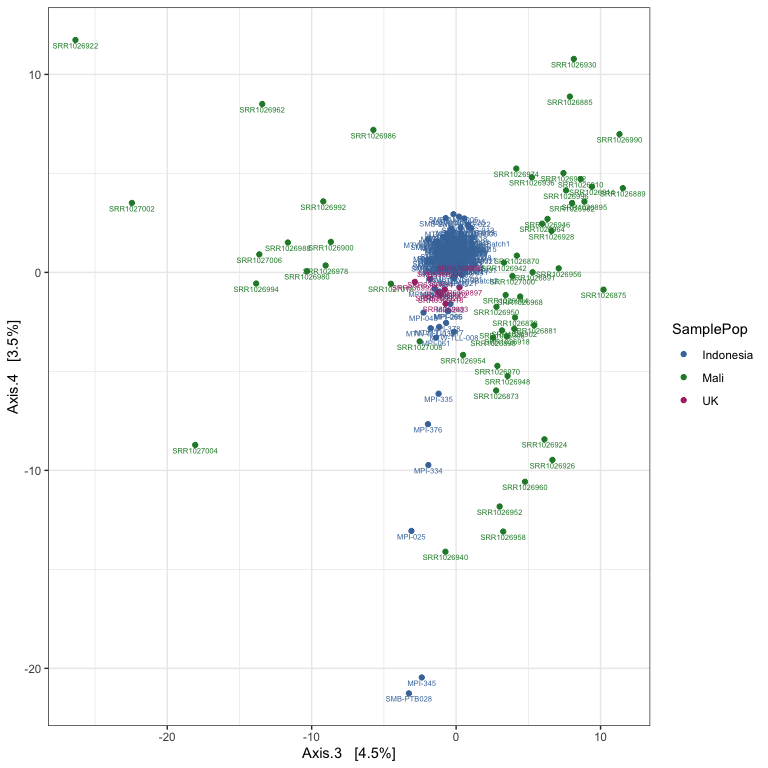

As seen in the first figure, PC1 separates groups by study. However in
PC4, we can see some of the Indonesian samples with a high Plasmodium
load separating away from the rest of the Indonesian samples. To better
visualise this, let’s highlight each sample by Plasmodium load (on the
log scale for easier
visualisation).

``` r
logged_phyla_counts = log10(colSums(otu_table(merged_phylo_counts)[grep("Apicomplexa",tax_table(merged_phylo_counts)[,"Phylum"])])+1)
sample_data(merged_phylo_counts_clr)[["Apicomplexa"]] = logged_phyla_counts
out.wuf.log <- ordinate(merged_phylo_counts_clr, method = "PCoA", distance = "euclidean")
plot_ordination(merged_phylo_counts_clr, out.wuf.log, color="Apicomplexa", axes = 3:4, label="SampleName")
```

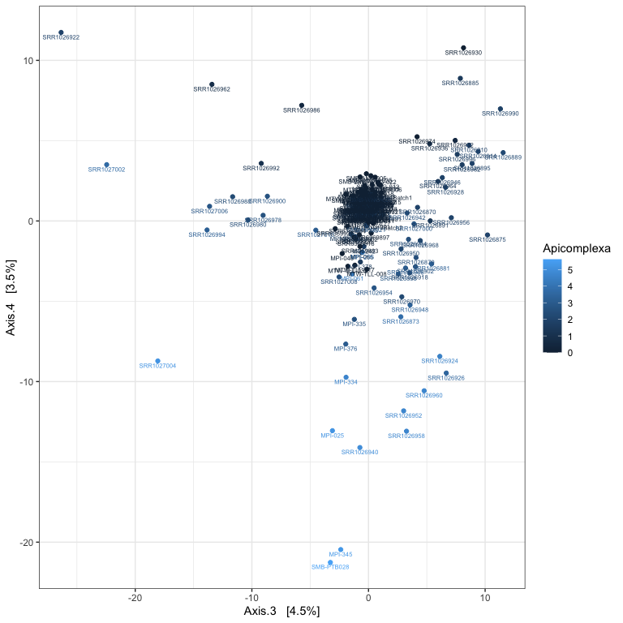

You can now see lighter blue samples (high Plasmodium load) separating
away from darker blue samples (no Plasmodium load).

Finally, let’s see how sample grouping looks like by another clustering
method - hierarchical clustering by Euclidean distance. Again, this is
done on the CLR-transformed data to correct for sequencing depth.

``` r
ps_otu <- data.frame(phyloseq::otu_table(merged_phylo_counts_clr))
ps_otu <- t(ps_otu)
bc_dist <- vegan::vegdist(ps_otu, method = "euclidean")
ward <- as.dendrogram(hclust(bc_dist, method = "ward.D2"))
#Provide color codes
meta <- data.frame(phyloseq::sample_data(merged_phylo_counts_clr))
colorCode <- c(Indonesia = IndonesiaCol, `Mali` = MaliCol, `UK` = UKCol)
labels_colors(ward) <- colorCode[meta$SamplePop][order.dendrogram(ward)]
#Plot
plot(ward)
```

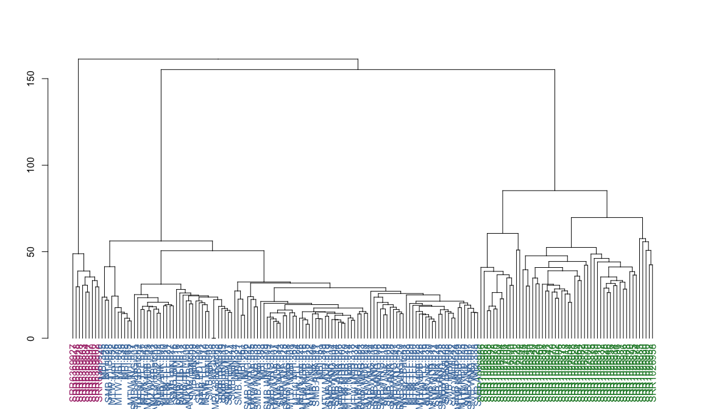

From hierarchical clustering, we can see that samples group by study,
which confirms what we saw in the PCA analysis.

# Relative frequency of taxa

One of the questions we’re most interested in when investigating these
samples is: what is in the data? One of the ways to do this is by
visualising the data itself. A common way to do this is by looking at a
stacked barplot, one for each sample, composed of the relative frequency
of taxa in that sample.

Why do we look at relative frequency? As we’ve seen before, our library
sizes are uneven, and therefore we want to see what the proportion of
each taxa is in each sample. However, compositional data does not
account for the fact that as one species goes up, it will force another
species to go down (i.e., it is bounded).

I’ll try to solve this problem in a few ways. The first way is by
plotting the relative taxa, then plotting the CLR-transformed data
(which is unbounded), and finally, seeing how this compares to rarefied
data.

To visualise relative frequency, I want to show my taxa at the family
level, however since there are over 450 unique taxa at the family level,
this would be difficult to visualise with so many colours. Instead,
we’ll make a new taxa variable which combines Superkingdom information
with Family-level information. This way, we can highlight colours by
superkingdom (which isn’t so visually overwhelming), and still preserve
Family-level information.

## Unsubsampled compositional data

``` r
# add a new column containing family names and superkingdom
tax_table(merged_phylo_counts)[,"Superkingdom"] = paste(tax_table(merged_phylo_counts)[,"Superkingdom"], tax_table(merged_phylo_counts)[,"Family"], sep="_")
tax_table(merged_phylo_counts)[,"Superkingdom"] <- gsub("Bacteria_$", "Bacteria_unclassified", tax_table(merged_phylo_counts)[,"Superkingdom"])
tax_table(merged_phylo_counts)[,"Superkingdom"] <- gsub("Eukaryota_$", "Eukaryota_unclassified", tax_table(merged_phylo_counts)[,"Superkingdom"])
tax_table(merged_phylo_counts)[,"Superkingdom"] <- gsub("Viruses_$", "Viruses_unclassified", tax_table(merged_phylo_counts)[,"Superkingdom"])
```

As pointed out, we have a lot of taxa at the family level, and it would
be hard to look over everything at once. Instead, we can focus on the
most prevalent taxa and highlight everything else in another colour.

Here, I chose to highlight the top 20 taxa, since that’s still
representative while not being too visually
exhausting.

``` r
aggregated_phyloCounts <- aggregate_top_taxa(merged_phylo_counts, "Superkingdom", top = 20)
# transform to relative counts
relative_phyloCounts <- microbiome::transform(aggregated_phyloCounts, "compositional")
# Remove weird extra family names added at the end of Superkingdom names
tax_table(relative_phyloCounts)[,"Superkingdom"] <- paste(sapply(strsplit(taxa_names(relative_phyloCounts), "[_.]"), `[`, 1), sapply(strsplit(taxa_names(relative_phyloCounts), "[_.]"), `[`, 2), sep="_")
# Change "Other_NA" to just "Other"
tax_table(relative_phyloCounts)[,"Superkingdom"][grep("Other", taxa_names(relative_phyloCounts))] = "Other"

# Plot
p=plot_bar(relative_phyloCounts, fill = "Superkingdom")

# set colour palette
families=levels(p$data$Superkingdom)
# get number of families in each kingdom
table(sapply(strsplit(families, "[_.]"), `[`, 1))
```

    ## 
    ##   Archaea  Bacteria Eukaryota     Other   Viruses 
    ##         1        15         2         1         2

``` r
PaletteArchaea = colorRampPalette(c("#DDCC77"))(1)
PaletteBacteria = colorRampPalette(c("#023858","#74a9cf"))(15)
PaletteEukaryote = colorRampPalette(c("#fd8d3c","#800026"))(2)
PaletteOther = colorRampPalette(c("black"))(1)
PaletteVirus = colorRampPalette(c("#78c679","#006837"))(2)

Merged_Palette <- c(PaletteArchaea,PaletteBacteria,PaletteEukaryote,PaletteOther,PaletteVirus)

phyloseq::plot_bar(relative_phyloCounts, fill = "Superkingdom") +
  geom_bar(aes(fill = Superkingdom), stat = "identity", position = "stack") +
  labs(x = "", y = "Relative Abundance\n") +
  facet_wrap(~ SamplePop, scales = "free") + scale_fill_manual(values=Merged_Palette) +
  theme(panel.background = element_blank(), axis.ticks.x=element_blank())
```

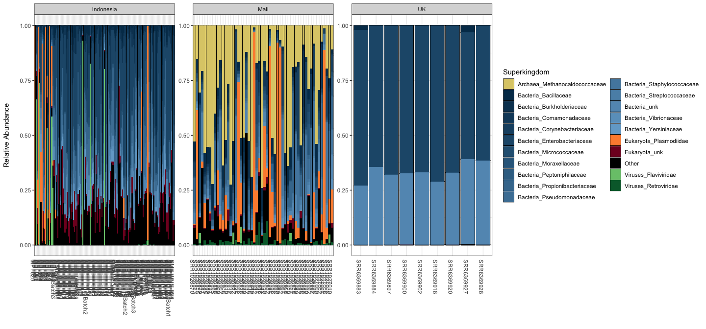

We can see that all populations have a high bacterial load, however in
the Malian and Indonesian dataset, there’a also a high abundance of
Plasmodium and flavivirus. We can also see that the Malian dataset has a
high proportion of reads mapping to archaea.

Although it’s not very easy to visualise (and I haven’t seen these
barplots in any other papers), let’s also visualise the data in a more
accurate way - by using CLR-transformed data rather than compositional
data.

``` r
aggregated_phyloCounts <- aggregate_top_taxa(merged_phylo_counts, "Superkingdom", top = 20)
# transform to relative counts
relative_phyloCounts <- microbiome::transform(aggregated_phyloCounts, "clr")
# Remove weird extra family names added at the end of Superkingdom names
tax_table(relative_phyloCounts)[,"Superkingdom"] <- paste(sapply(strsplit(taxa_names(relative_phyloCounts), "[_.]"), `[`, 1), sapply(strsplit(taxa_names(relative_phyloCounts), "[_.]"), `[`, 2), sep="_")
# Change "Other_NA" to just "Other"
tax_table(relative_phyloCounts)[,"Superkingdom"][grep("Other", taxa_names(relative_phyloCounts))] = "Other"

# Plot
p=plot_bar(relative_phyloCounts, fill = "Superkingdom")

# set colour palette
families=levels(p$data$Superkingdom)
# get number of families in each kingdom
table(sapply(strsplit(families, "[_.]"), `[`, 1))
```

    ## 
    ##   Archaea  Bacteria Eukaryota     Other   Viruses 
    ##         1        15         2         1         2

``` r
PaletteArchaea = colorRampPalette(c("#DDCC77"))(1)
PaletteBacteria = colorRampPalette(c("#023858","#74a9cf"))(15)
PaletteEukaryote = colorRampPalette(c("#fd8d3c","#800026"))(2)
PaletteOther = colorRampPalette(c("black"))(1)
PaletteVirus = colorRampPalette(c("#78c679","#006837"))(2)

Merged_Palette <- c(PaletteArchaea,PaletteBacteria,PaletteEukaryote,PaletteOther,PaletteVirus)

phyloseq::plot_bar(relative_phyloCounts, fill = "Superkingdom") +
  geom_bar(aes(fill = Superkingdom), stat = "identity", position = "stack") +
  labs(x = "", y = "Relative Abundance\n") +
  facet_wrap(~ SamplePop, scales = "free") + scale_fill_manual(values=Merged_Palette) +
  theme(panel.background = element_blank(), axis.ticks.x=element_blank())
```

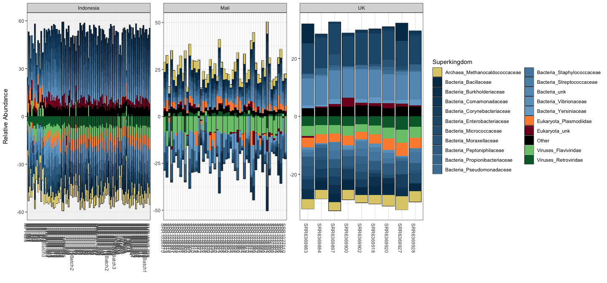
On the negative y-axis for each plot, you can see what each sample
lacks. For example, all samples within the Indonesian dataset clearly
lack Methanocaldococcaceae (Archaea), and all samples within the UK
dataset lack Plasmodium.

Now let’s see how this looks like in the rarefied data.

## Rarefied compositional data

Although we generally want to avoid rarefaction, we will use it here for
the purposes of comparing it to our unsubsampled, compositional data.
Recently, a package called [SRS](https://peerj.com/articles/9593/)
(standing for Scaling with Ranked Subsampling) came out in R and it
preserves OTU frequencies by 1) scaling counts by a constant factor
where the sum of the scaled counts equals the minimum library size
chosen by the user and 2) performing a ranked subsampling on the data.
Since this is the best method I could find for rarefying while
preserving the original library composition, we will use this method.

SRS require that you use a minimum value to rarefy to. I chose a minimum
(in the function, it’s called Cmin) of 2,000 since a [seminal
paper](https://www.pnas.org/content/108/Supplement_1/4516) in the
microbiome field tested this and found that 2,000 single-end reads are
sufficient for detecting most communities. Rarefying to 2,000 also
results in the loss of many samples, so I don’t want to rarefy to a
higher depth than that.

SRS won’t work if we have samples with a library size under our minimum
threshold, so let’s remove all samples under 2000, then perform
rarefaction.

``` r
minControl=2000
keep=names(which(sample_sums(merged_phylo_counts)>=minControl))
pruned_data=prune_samples(keep, merged_phylo_counts)
any(taxa_sums(pruned_data) == 0)
```

    ## [1] TRUE

``` r
pruned_data <- prune_taxa(taxa_sums(pruned_data) > 0, pruned_data)
any(taxa_sums(pruned_data) == 0)
```

    ## [1] FALSE

``` r
pruned_data_df=as.data.frame(otu_table(pruned_data))
SRS=SRS(pruned_data_df,minControl)
rownames(SRS)=rownames(pruned_data_df)

table(sample_data(pruned_data)[,"SamplePop"])
```

    ## 
    ## Indonesia      Mali        UK 
    ##        16        54         9

After pruning the data, we can see that only 16 Indonesian samples
remain out of the original 117 (so we lost 101\!). Now let’s add the
rarefied data to the pruned phyloseq object.

``` r
# transform back into phyloseq object
taxa = otu_table(SRS, taxa_are_rows = TRUE)
otu_table(pruned_data)=taxa
any(taxa_sums(pruned_data) == 0)
```

    ## [1] TRUE

``` r
pruned_data <- prune_taxa(taxa_sums(pruned_data) > 0, pruned_data)
any(taxa_sums(pruned_data) == 0)
```

    ## [1] FALSE

Now let’s make sure the library sizes are the same and see how the OTU
numbers look like between datasets.

``` r
SeqDepthPruned = sample_sums(pruned_data)
sample_data(pruned_data)$SeqDepthPruned = SeqDepthPruned

# barplot of library sizes
ggplot(meta(pruned_data), aes(SampleName, SeqDepthPruned)) + geom_bar(stat = "identity", aes(fill = SamplePop)) +
scale_fill_manual(values = c(IndonesiaCol,MaliCol,UKCol)) + rotate_x_text()
```

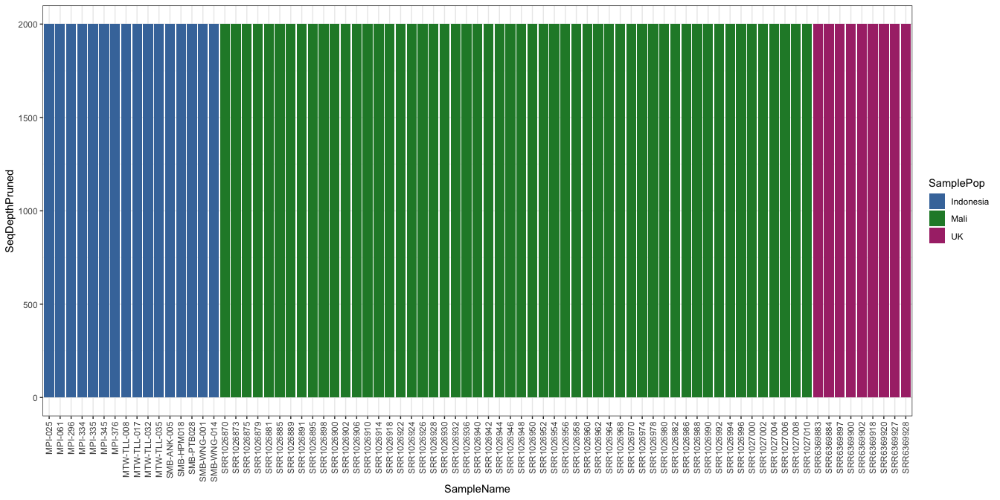

``` r
# get barplot of total counts per individual
nOTUs = colSums(otu_table(pruned_data)!=0)
sample_data(pruned_data)$nOTUs = nOTUs

# barplot of OTUs
ggplot(meta(pruned_data), aes(SampleName, nOTUs)) + geom_bar(stat = "identity", aes(fill = SamplePop)) +
scale_fill_manual(values = c(IndonesiaCol,MaliCol,UKCol)) + rotate_x_text()
```

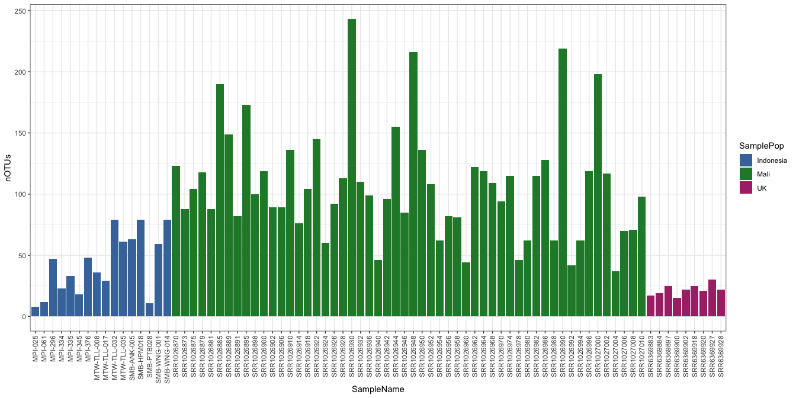
Finally, lets compare the rarefied data to the compositional data.

``` r
# add a new column containing family names and superkingdom
tax_table(pruned_data)[,"Superkingdom"] = paste(tax_table(pruned_data)[,"Superkingdom"], tax_table(pruned_data)[,"Family"], sep="_")
tax_table(pruned_data)[,"Superkingdom"] <- gsub("Bacteria_$", "Bacteria_unclassified", tax_table(pruned_data)[,"Superkingdom"])
tax_table(pruned_data)[,"Superkingdom"] <- gsub("Eukaryota_$", "Eukaryota_unclassified", tax_table(pruned_data)[,"Superkingdom"])
tax_table(pruned_data)[,"Superkingdom"] <- gsub("Viruses_$", "Viruses_unclassified", tax_table(pruned_data)[,"Superkingdom"])

# For some reason, top is actually top + 1, so here it would be 20
aggregated_phyloCounts <- aggregate_top_taxa(pruned_data, "Superkingdom", top = 20)
# transform to relative counts
relative_phyloCounts <- microbiome::transform(aggregated_phyloCounts, "compositional")
# Remove weird extra family names added at the end of Superkingdom names
tax_table(relative_phyloCounts)[,"Superkingdom"] <- paste(sapply(strsplit(taxa_names(relative_phyloCounts), "[_.]"), `[`, 1), sapply(strsplit(taxa_names(relative_phyloCounts), "[_.]"), `[`, 2), sep="_")
# Change "Other_NA" to just "Other"
tax_table(relative_phyloCounts)[,"Superkingdom"][grep("Other", taxa_names(relative_phyloCounts))] = "Other"

# Plot
p=plot_bar(relative_phyloCounts, fill = "Superkingdom")

# set colour palette
families=levels(p$data$Superkingdom)
# get number of families in each kingdom
table(sapply(strsplit(families, "[_.]"), `[`, 1))
```

    ## 
    ##   Archaea  Bacteria Eukaryota     Other   Viruses 
    ##         1        13         3         1         3

``` r
PaletteArchaea = colorRampPalette(c("#DDCC77"))(1)
PaletteBacteria = colorRampPalette(c("#023858","#74a9cf"))(13)
PaletteEukaryote = colorRampPalette(c("#fd8d3c","#800026"))(3)
PaletteOther = colorRampPalette(c("black"))(1)
PaletteVirus = colorRampPalette(c("#78c679","#006837"))(3)

Merged_Palette <- c(PaletteArchaea,PaletteBacteria,PaletteEukaryote,PaletteOther,PaletteVirus)

phyloseq::plot_bar(relative_phyloCounts, fill = "Superkingdom") +
  geom_bar(aes(fill = Superkingdom), stat = "identity", position = "stack") +
  labs(x = "", y = "Relative Abundance\n") +
  facet_wrap(~ SamplePop, scales = "free") + scale_fill_manual(values=Merged_Palette) +
  theme(panel.background = element_blank(), axis.text.x=element_blank(), axis.ticks.x=element_blank())
```

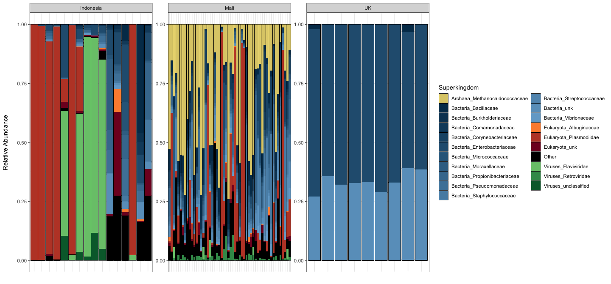
Although a lot of the samples are missing, the same trend still holds
true- bacteria dominating the UK samples, while apicomplexa, flavivirus,
and archae being dominant in the Indonesian and Malian samples.

# Differential abundance testing

We’re interested in testing whether the species composition between
populations is significantly different. Visually, we saw that the
populations look different, but we can’t say that for sure. One way to
test this is through differential abundance testing.

One of the best packages I’ve found so far to test this is called
[Aldex2](https://journals.plos.org/plosone/article?id=10.1371/journal.pone.0067019)
(ANOVA-Like Differential Expression). Aldex2 works by generatating a
posterior probability (128 by default) for an observed instance of a
taxon (adding a small prior to deal with zeros), then performing a
centered log-ratio transformation on the data as a normalisation step
(this deals with uneven library sizes). To identify differentially
expressed genes, Aldex2 then performs a significance test using a
Wilcoxon rank test, and finally, the probability of the taxon being
differentially abundant is adjusted with FDR correction (by
Benjamini–Hochberg).

Aldex2 corrects for uneven library sizes, so rarefying is not necessary.
The only input we need is the data with singletons removed.

Since Aldex2 works by comparing two datasets, we need to subset the
dataset. I’ll first compare the Indonesian dataset to the UK dataset,
then the Indonesian dataset to the Malian dataset.

``` r
# Differential abundance testing
IndoVsUK=subset_samples(merged_phylo_counts, SamplePop != "Mali")
any(taxa_sums(IndoVsUK) == 0)
```

    ## [1] TRUE

``` r
# remove any 0s from the data
IndoVsUK <- prune_taxa(taxa_sums(IndoVsUK) > 0, IndoVsUK)
taxa_names(IndoVsUK)=make.unique(tax_table(IndoVsUK)[,"Family"])
# Run aldex2
aldex2_IndoVsUK <- ALDEx2::aldex(data.frame(phyloseq::otu_table(IndoVsUK)), phyloseq::sample_data(IndoVsUK)$SamplePop, test="t", effect = TRUE)
```

Let’s now pull out the significant values after getting the ALdex2
ouput. We’re interested in the columns

``` r
sig_aldex2_IndoVsUK <- aldex2_IndoVsUK %>%
  rownames_to_column(var = "OTU") %>%
  filter(wi.eBH < 0.05) %>%
  arrange(effect, wi.eBH) %>%
  dplyr::select(OTU, diff.btw, diff.win, effect, wi.ep, wi.eBH)

# add in taxonomic information to the significant IndoVsUK object
taxa_info <- data.frame(tax_table(IndoVsUK))
taxa_info <- taxa_info %>% rownames_to_column(var = "OTU")
sig_aldex2_IndoVsUK <- left_join(sig_aldex2_IndoVsUK, taxa_info)

# set significance colours
aldex2_IndoVsUK$threshold <- aldex2_IndoVsUK$we.eBH <= 0.05
aldex2_IndoVsUK$threshold = as.numeric(aldex2_IndoVsUK$threshold) + 1

# adjust label names
# first, find out what all the "unk_f" family names are about
sig_aldex2_IndoVsUK[grep("unk.f.",sig_aldex2_IndoVsUK$OTU),]
```

    ##          OTU  diff.btw diff.win    effect        wi.ep       wi.eBH
    ## 7  unk_f.103  5.720934 5.982085 0.9491747 1.193525e-04 3.812436e-03
    ## 9  unk_f.212  7.083868 6.406556 1.0097227 7.737994e-04 1.858671e-02
    ## 14  unk_f.99  5.480701 4.492051 1.0960097 6.966889e-04 1.555479e-02
    ## 17 unk_f.228  5.102076 4.171927 1.1893496 4.321106e-04 1.099495e-02
    ## 20  unk_f.98  5.471667 4.223078 1.2191006 5.158833e-04 1.263671e-02
    ## 39 unk_f.108 12.915259 6.338805 2.1560636 6.120182e-07 5.315413e-05
    ## 44 unk_f.230  7.139434 2.674884 2.8025951 6.120182e-07 5.315413e-05
    ## 45 unk_f.100 11.770851 4.323719 2.9189872 6.120182e-07 5.315413e-05
    ## 48 unk_f.112 11.745523 3.137399 3.5351707 6.237622e-07 5.316908e-05
    ## 50 unk_f.104 15.782845 3.538006 4.1338729 6.122582e-07 5.315413e-05
    ## 51 unk_f.113 15.709563 3.928672 4.2620098 6.120182e-07 5.315413e-05
    ## 54  unk_f.16 15.027778 2.511727 6.2311809 6.120182e-07 5.315413e-05
    ##      Superkingdom Kingdom         Phylum               Class            Order
    ## 7  Bacteria_unk_f   unk_k Proteobacteria Gammaproteobacteria            unk_o
    ## 9    unk_sk_unk_f   unk_k          unk_p               unk_c            unk_o
    ## 14 Bacteria_unk_f   unk_k Proteobacteria Gammaproteobacteria Enterobacterales
    ## 17 Bacteria_unk_f   unk_k          unk_p               unk_c            unk_o
    ## 20 Bacteria_unk_f   unk_k Proteobacteria Gammaproteobacteria Enterobacterales
    ## 39 Bacteria_unk_f   unk_k Proteobacteria Gammaproteobacteria            unk_o
    ## 44 Bacteria_unk_f   unk_k          unk_p               unk_c            unk_o
    ## 45 Bacteria_unk_f   unk_k Proteobacteria Gammaproteobacteria Enterobacterales
    ## 48 Bacteria_unk_f   unk_k Proteobacteria               unk_c            unk_o
    ## 50 Bacteria_unk_f   unk_k Proteobacteria Gammaproteobacteria            unk_o
    ## 51 Bacteria_unk_f   unk_k Proteobacteria               unk_c            unk_o
    ## 54 Bacteria_unk_f   unk_k Actinobacteria      Actinobacteria            unk_o
    ##    Family Genus                                  Species
    ## 7   unk_f                                               
    ## 9   unk_f unk_g              unidentified cloning vector
    ## 14  unk_f unk_g                                         
    ## 17  unk_f unk_g                       bacterium IARFR971
    ## 20  unk_f                                               
    ## 39  unk_f unk_g uncultured Gammaproteobacteria bacterium
    ## 44  unk_f unk_g                       bacterium T-1-0-4H
    ## 45  unk_f unk_g    uncultured Enterobacterales bacterium
    ## 48  unk_f unk_g                                         
    ## 50  unk_f unk_g                                         
    ## 51  unk_f unk_g               uncultured proteobacterium
    ## 54  unk_f unk_g               uncultured actinobacterium

``` r
# change "unk_f" to uncultured bacteria
labels = sapply(strsplit(rownames(aldex2_IndoVsUK), "[..]"), `[`, 1) %>% gsub("unk_f","Uncultured Bacteria",.)
taxa_superkingdom = sapply(strsplit(tax_table(IndoVsUK)[,"Superkingdom"], "[_.]"), `[`, 1) %>% gsub("unk_p","Fungi",.)

# plot
ggplot(aldex2_IndoVsUK) +
  geom_point(aes(x = effect, y = -log10(wi.eBH)), color = ifelse(aldex2_IndoVsUK$wi.eBH <= 0.05, c("grey","#023858","#800026","grey","#78c679")[as.numeric(as.factor(taxa_superkingdom))],"black"), alpha = 0.65, size=5) +
  #geom_text_repel(aes(x = effect, y = -log10(wi.eBH), label = rownames(aldex2_IndoVsDutch))) +
  geom_text_repel(aes(x = effect, y = -log10(wi.eBH), label = ifelse(wi.eBH <= 0.001, labels,""))) +
  ggtitle("Indonesia Versus UK") +
  xlab("Effect Size") + 
  ylab("-log10 adjusted p-value") +
  theme(legend.position = "bottom",
        plot.title = element_text(size = rel(1.5), hjust = 0.5),
        axis.title = element_text(size = rel(1.25)))
```

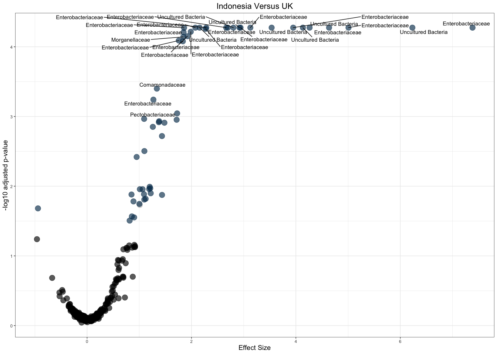

``` r
IndoVsMali=subset_samples(merged_phylo_counts, SamplePop != "UK")
any(taxa_sums(IndoVsMali) == 0)
```

    ## [1] TRUE

``` r
IndoVsMali <- prune_taxa(taxa_sums(IndoVsMali) > 0, IndoVsMali)
taxa_names(IndoVsMali)=make.unique(tax_table(IndoVsMali)[,"Family"])
aldex2_IndoVsMali <- ALDEx2::aldex(data.frame(phyloseq::otu_table(IndoVsMali)), phyloseq::sample_data(IndoVsMali)$SamplePop, test="t", effect = TRUE)
sig_aldex2_IndoVsMali <- aldex2_IndoVsMali %>%
  rownames_to_column(var = "OTU") %>%
  filter(wi.eBH < 0.05) %>%
  arrange(effect, wi.eBH) %>%
  dplyr::select(OTU, diff.btw, diff.win, effect, wi.ep, wi.eBH)

# add in taxonomic information to the significant IndoVsMali object
taxa_info <- data.frame(tax_table(IndoVsMali))
taxa_info <- taxa_info %>% rownames_to_column(var = "OTU")
sig_aldex2_IndoVsMali <- left_join(sig_aldex2_IndoVsMali, taxa_info)

# set significance colours
aldex2_IndoVsMali$threshold <- aldex2_IndoVsMali$we.eBH <= 0.05
aldex2_IndoVsMali$threshold = as.numeric(aldex2_IndoVsMali$threshold) + 1

# adjust label names
# first, find out what all the "unk_f" family names are about
sig_aldex2_IndoVsMali[grep("unk.f",sig_aldex2_IndoVsMali$OTU),]
```

    ##          OTU diff.btw diff.win    effect        wi.ep       wi.eBH
    ## 8  unk_f.126 2.110844 4.985466 0.3772158 1.308489e-03 3.944775e-02
    ## 9  unk_f.211 2.205734 5.001104 0.3909035 1.462802e-03 3.720846e-02
    ## 10  unk_f.37 2.008717 4.606674 0.3927762 1.169250e-03 2.927706e-02
    ## 13  unk_f.11 2.305248 5.042959 0.4063521 2.464067e-03 4.454667e-02
    ## 18  unk_f.48 2.274368 4.782441 0.4321528 6.746313e-04 1.490622e-02
    ## 20 unk_f.105 2.368427 4.687864 0.4376900 6.490989e-04 1.703470e-02
    ## 21   unk_f.7 2.485165 5.036591 0.4508547 4.120641e-04 1.030506e-02
    ## 32  unk_f.96 3.121395 4.663776 0.5900863 2.641143e-08 3.423317e-06
    ## 35  unk_f.15 3.619582 5.081251 0.6273622 1.506556e-06 1.202676e-04
    ## 39 unk_f.457 4.023860 4.847918 0.7405303 1.206119e-08 1.485035e-06
    ## 40  unk_f.17 3.252092 3.856703 0.7701635 9.136682e-14 2.774163e-11
    ## 50   unk_f.9 5.222703 4.255585 1.1869270 9.924564e-20 9.374045e-17
    ##       Superkingdom Kingdom         Phylum               Class             Order
    ## 8   Bacteria_unk_f   unk_k          unk_p               unk_c             unk_o
    ## 9  Eukaryota_unk_f   Fungi          unk_p               unk_c             unk_o
    ## 10  Bacteria_unk_f   unk_k  Cyanobacteria               unk_c             unk_o
    ## 13  Bacteria_unk_f   unk_k Actinobacteria      Actinobacteria Corynebacteriales
    ## 18  Bacteria_unk_f   unk_k     Firmicutes               unk_c             unk_o
    ## 20  Bacteria_unk_f   unk_k Proteobacteria Gammaproteobacteria  Enterobacterales
    ## 21  Bacteria_unk_f   unk_k Actinobacteria      Actinobacteria   Actinomycetales
    ## 32  Bacteria_unk_f   unk_k Proteobacteria  Betaproteobacteria             unk_o
    ## 35  Bacteria_unk_f   unk_k Actinobacteria      Actinobacteria             unk_o
    ## 39   Viruses_unk_f   unk_k          unk_p               unk_c             unk_o
    ## 40  Bacteria_unk_f   unk_k Actinobacteria      Actinobacteria             unk_o
    ## 50  Bacteria_unk_f   unk_k Actinobacteria      Actinobacteria   Actinomycetales
    ##    Family      Genus                               Species
    ## 8   unk_f      unk_g                             bacterium
    ## 9   unk_f                                                 
    ## 10  unk_f      unk_g             uncultured cyanobacterium
    ## 13  unk_f Lawsonella             Lawsonella clevelandensis
    ## 18  unk_f      unk_g       uncultured Firmicutes bacterium
    ## 20  unk_f      unk_g uncultured Enterobacterales bacterium
    ## 21  unk_f      unk_g                                      
    ## 32  unk_f      unk_g       uncultured beta proteobacterium
    ## 35  unk_f      unk_g                                      
    ## 39  unk_f                                                 
    ## 40  unk_f      unk_g            uncultured actinobacterium
    ## 50  unk_f      unk_g  uncultured Actinomycetales bacterium

``` r
# all of these unk_f taxa are bacteria with the exception of unk_f.457. Change this one to a virus
rownames(aldex2_IndoVsMali)[rownames(aldex2_IndoVsMali) == "unk_f.457"] <-  "Uncharacterised_Virus"
# change all other "unk_f" taxa to uncultured bacteria and adjust all other label names to just be the first word in the family names
labels = sapply(strsplit(rownames(aldex2_IndoVsMali), "[..]"), `[`, 1) %>% gsub("unk_f","Uncultured Bacteria",.)
taxa_superkingdom = sapply(strsplit(tax_table(IndoVsMali)[,"Superkingdom"], "[_.]"), `[`, 1) %>% gsub("unk_p","Fungi",.)

# plot
ggplot(aldex2_IndoVsMali) +
  geom_point(aes(x = effect, y = -log10(wi.eBH)), color = ifelse(aldex2_IndoVsMali$wi.eBH <= 0.05, c("#DDCC77","#023858","#800026","grey","#78c679")[as.numeric(as.factor(taxa_superkingdom))],"black"), alpha = 0.65, size=5) +
  geom_text_repel(aes(x = effect, y = -log10(wi.eBH), label = ifelse(wi.eBH <= 0.001, labels,""))) +
  ggtitle("Indonesia Versus Mali") +
  xlab("Effect Size") + 
  ylab("-log10 adjusted p-value") +
  theme(legend.position = "none",
        plot.title = element_text(size = rel(1.5), hjust = 0.5),
        axis.title = element_text(size = rel(1.25)))
```

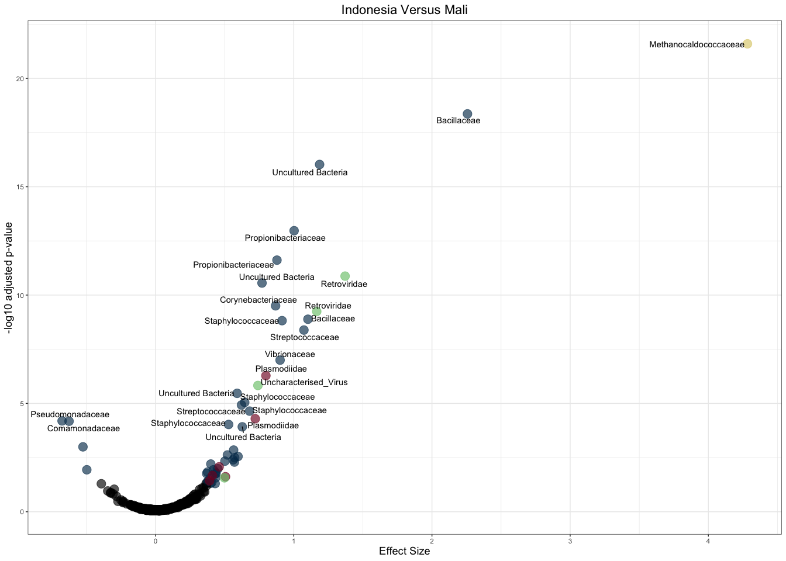

# Alpha diversity

Alpha diversity measures within-sample diverity and looks at how many
taxa are observed, as well as how evenly they are distributed.

There is a lot of controversy around how best to analyse alpha
diversity. Because a higher sequencing depth will lead to a greater
likelihood of diversity, many people rarefy their data beforehand.
However, rarefying data (as pointed out above), not only discards data,
but leads to biases when rarefied.

Current tools to estimate alpha diversity either underestimate richness
or underestimate uncertainty, however DivNet is a package that adresses
these problems. Divnet is a method for estimating within- and
between-community diversity in ecosystems where taxa interact via an
ecological network. It accounts for differences in sequencing depth and
estimates the number of missing species based on the sequence depth and
number of rare taxa in the data.

To use DivNet, you need unsubsampled data without removing
singletons.

``` r
# Get phyloseq object without singletons by merging original phyloseq objects
merged_phylo_counts_withSingletons <- merge_phyloseq(AllREadsSE_Indo_Counts_physeq, Mali_Counts_physeq, European_Counts_physeq)
# Remove Viridiplantae and Metazoa
merged_phylo_counts_withSingletons <- subset_taxa(merged_phylo_counts_withSingletons, (Kingdom!="Viridiplantae"))
merged_phylo_counts_withSingletons <- subset_taxa(merged_phylo_counts_withSingletons, (Kingdom!="Metazoa"))
# remove our outlier sample
merged_phylo_counts_withSingletons <- subset_samples(merged_phylo_counts_withSingletons, SampleName != "SRR6369904")
# remove any empty rows
merged_phylo_counts_withSingletons <- prune_taxa(taxa_sums(merged_phylo_counts_withSingletons) > 0, merged_phylo_counts_withSingletons)
```

Now that we have data without singletons, we now need to merge our data
at a specified taxonomic level. DivNet is computationally expensive, and
therefore a higher level is much, much faster. We’ll therefore test how
our groups look like at the Phylum level. Then, we’ll run DivNet without
specifying any hypothesis testing.

``` r
# comparing diversity at the phylum level
pop_comparison <- merged_phylo_counts_withSingletons %>%
  tax_glom("Phylum")

# If we don't change the sample names here from hyphens to periods, we'll get an error later
sample_names(pop_comparison) <- gsub("\\-", ".", sample_names(pop_comparison))

# Run divnet without specifying any hypothesis testing
dv_pop_comparison <- divnet(pop_comparison, ncores = 4)
```

DivNet will output an object with estimates for multiple different alpha
(and beta) diversity measures (we’ll get to the beta diversity estimates
later). The Shannon and Simpson index are two popular alpha diversity
indices to measure species richness. For Shannon diversity, the
importance of rare taxa are downeighted, since they do not play a large
role in the community or they could potentially be due to error. For
this reason, the Shannon index is one of the most popular alpha
diversity metrics.

To interpret the index, a higher Shannon index means higher diversity,
whereas a lowed index number means lower diversity.

Let’s take out the Shannon diversity metric from DivNet and plot it.

``` r
# Now let's plot the results of shannon and Simpson diversity
summary_df_shannon <- as.data.frame(dv_pop_comparison$shannon %>%
  summary %>%
  add_column("SampleNames" = pop_comparison %>% otu_table %>% sample_names) %>%
  add_column("SamplePop" =  pop_comparison %>% sample_data %>% .[,"SamplePop"] %>% as.matrix(.) %>% .[,1] %>% unname(.)))

ggplot(summary_df_shannon, aes(y = estimate, x = SamplePop, fill = SamplePop)) + geom_violin(alpha=0.7) + 
  geom_jitter(height = 0, width = .2) + geom_boxplot(width=0.08, outlier.color = NA) +
  scale_fill_manual(values=c(IndonesiaCol,MaliCol,UKCol)) + ggtitle("Shannon Diversity") +
  ylab("Estimate of Shannon Diversity")
```

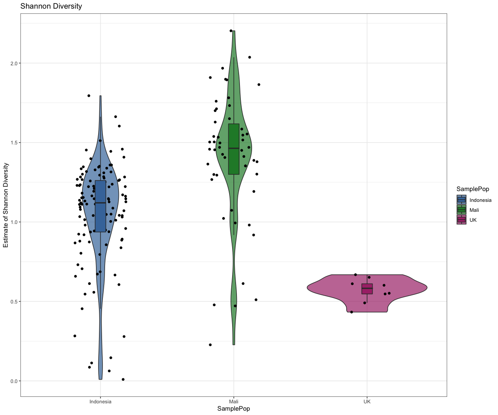

We can see that the Malian samples, on average, have the highest
estimates of Shannon alpha diversity, followed by the Indonesian
population, then the UK population.

We can also plot each individual sample, along with their standard
deviation (another cool, and imprortant feature that DivNet calculates
and uses in their hypothesis
testing).

``` r
plot(dv_pop_comparison$shannon, pop_comparison, col = "SamplePop") + scale_colour_manual(values=c(IndonesiaCol,MaliCol,UKCol))
```

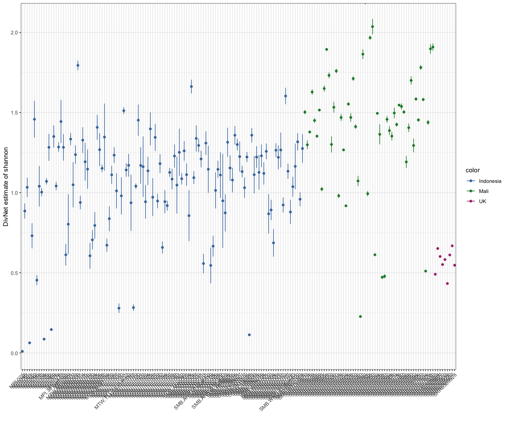

We can see that the Indonesian samples have the highest amount of SE
around their estimates, but this makes sense given that this is the
population with the lowest library size.

Now let’s see how the population diversity looks like when we use the
Simpson diversity index. The Simpson diversity index is a similarity
index where the higher the value, the lower the diversity. It measures
the probability that two individuals randomly selected from a sample
will belong to the same species. With this index, 0 represents infinite
diversity and 1, no diversity.

``` r
summary_df_simpson <- as.data.frame(dv_pop_comparison$simpson %>%
  summary %>%
  add_column("SampleNames" = pop_comparison %>% otu_table %>% sample_names) %>%
  add_column("SamplePop" =  pop_comparison %>% sample_data %>% .[,"SamplePop"] %>% as.matrix(.) %>% .[,1] %>% unname(.)))

ggplot(summary_df_simpson, aes(y = estimate, x = SamplePop, fill = SamplePop)) + geom_violin(alpha=0.7) + 
  geom_jitter(height = 0, width = .2) + geom_boxplot(width=0.08, outlier.color = NA) +
  scale_fill_manual(values=c(IndonesiaCol,MaliCol,UKCol)) + ggtitle("Simpson's Diversity Index") +
  ylab("Estimate of Simpson Diversity")
```

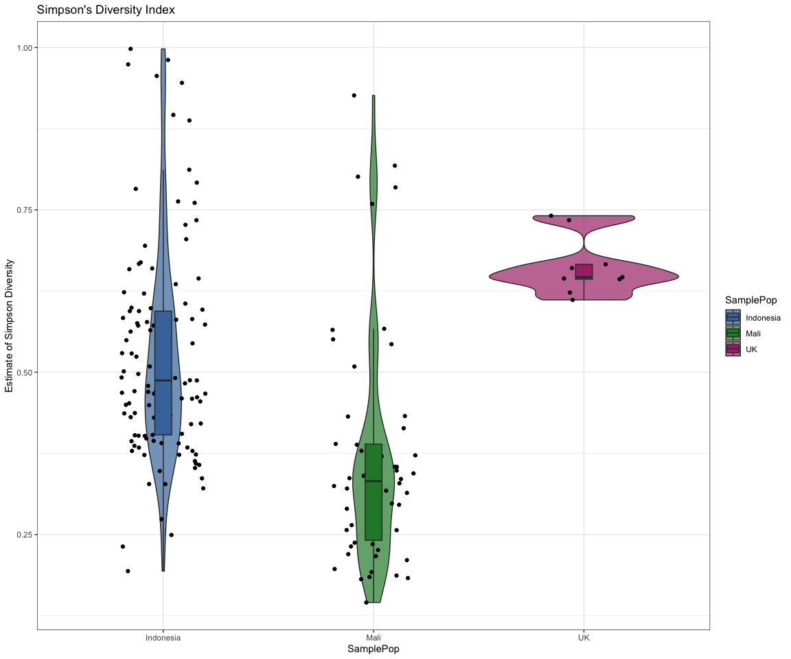

Again, we can see that the same trend holds true - the Malian population
has the highest diversity (remember, and index of 0 equates to infinite
diversity), while the UK population has the lowest diversity.

This is how the diversity looks like with SE included for each
sample.

``` r
plot(dv_pop_comparison$simpson, pop_comparison, col = "SamplePop") + scale_colour_manual(values=c(IndonesiaCol,MaliCol,UKCol))
```

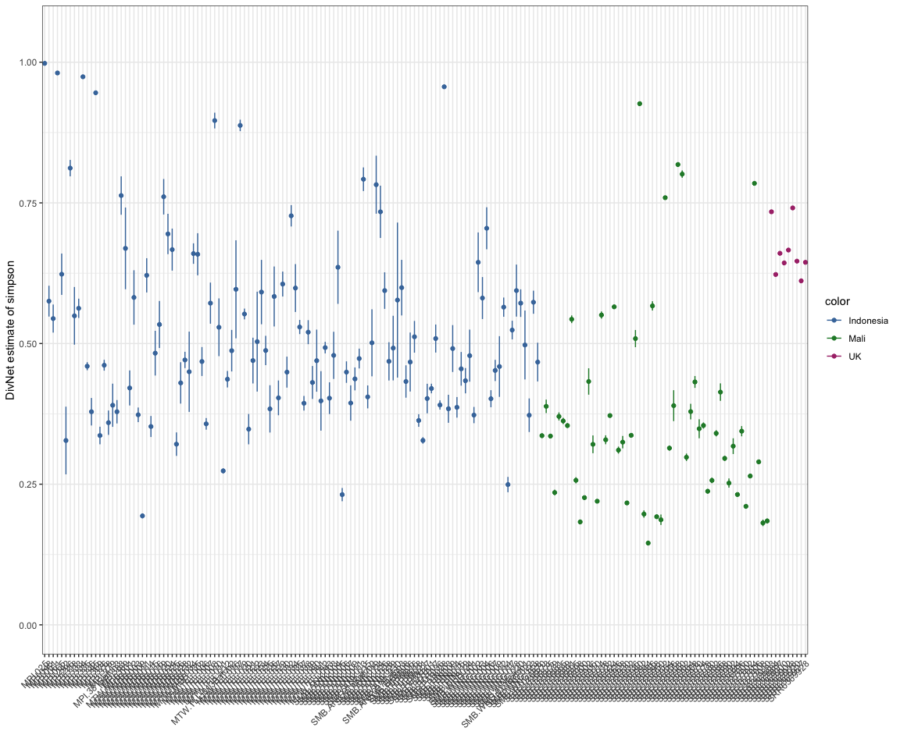
Since a larger Simpson index value equates to a lower diversity index,
many people find this confusing and not very intuitive. Therefore, the
inverse Simpsone Index, or 1 - Simpson Index, is also commonly used.
Let’s plot that now.

``` r
# Subtract the Simpson estimate from one
summary_df_simpson$estimate = 1-summary_df_simpson$estimate
# Plot
ggplot(summary_df_simpson, aes(y = estimate, x = SamplePop, fill = SamplePop)) + geom_violin(alpha=0.7) + 
  geom_jitter(height = 0, width = .2) + geom_boxplot(width=0.08, outlier.color = NA) +
  scale_fill_manual(values=c(IndonesiaCol,MaliCol,UKCol)) + ggtitle("Simpson's Diversity Index") +
  ylab("Estimate of Simpson Diversity")
```

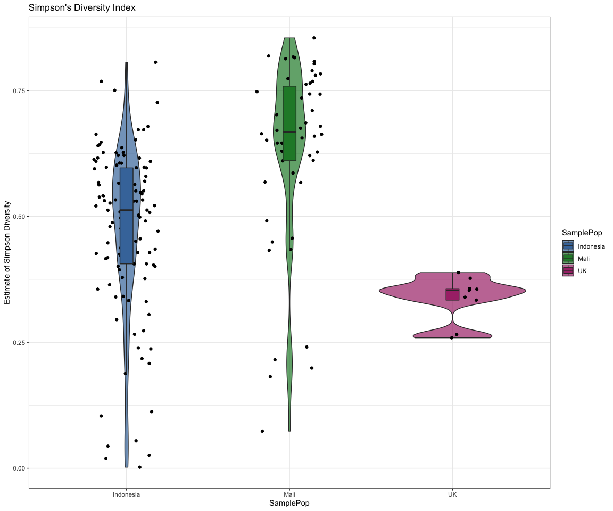

Now let’s test the hypothesis that the diversity is different between
islands, which is really what we’re asking - are the taxa communities
between our groups different? This is holding the assumption that the
populations are part of a shared ecosystem that has similarities in, for
example, pathogen load. We are now estimating the diversity of
island/population being an ecosystem, so we’re focusing on the
ecosystem, not just the samples. If we wanted to reproduce this result,
it is better to focus on the populations that the samples come from, not
just the samples themselves.

Let’s test this first using the Shannon diversity index.

``` r
# test the hypothesis that the diversity is differnet between islands
dv_pop_comparison_cov <- pop_comparison %>%
  divnet(X = "SamplePop", ncores = 8)

# Plot the results for each individual
plot(dv_pop_comparison_cov$shannon, pop_comparison, col = "SamplePop") + scale_colour_manual(values=c(IndonesiaCol,MaliCol,UKCol))
```

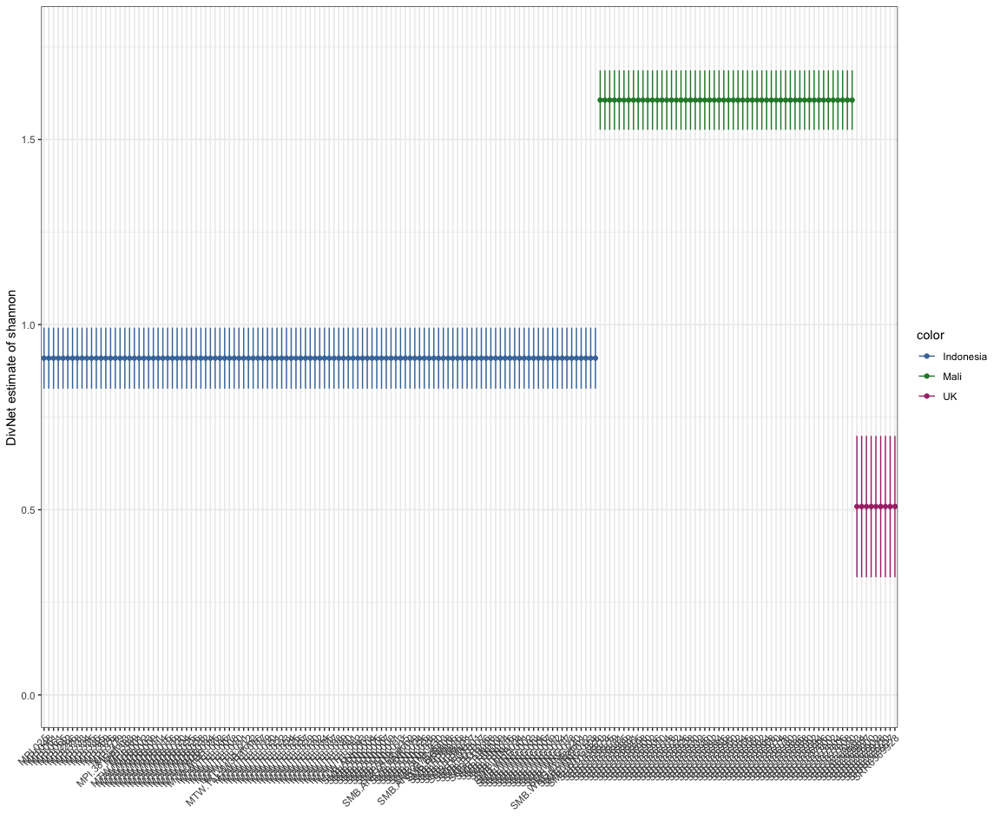

We can see that, as a population, the Malian samples have the highest
diversity, followed by the Indonesian samples, then the UK samples.

Let’s test this hypothesis formally.

``` r
# test that these populations are actually different
testDiversity(dv_pop_comparison_cov, "shannon")
```

    ## Hypothesis testing:
    ##   p-value for global test: 0

    ##                 Estimates Standard Errors p-values
    ## (Intercept)     0.9093817      0.00310856        0
    ## predictorsMali  0.6968259      0.00546205        0
    ## predictorsUK   -0.4006477      0.03181906        0

The result tells us that the mean Shannon diversity in the Indonesian
population at the Phylum-level is 0.91, and it is significantly higher
by 0.7 orders, on average, in the Malian population. We can also see
that the UK population is significantly lower than the Indonesian
population by 0.4 orders, on average.

Let’s do the same thing for Simpson
diversity.

``` r
plot(dv_pop_comparison_cov$simpson, pop_comparison, col = "SamplePop") + scale_colour_manual(values=c(IndonesiaCol,MaliCol,UKCol))
```

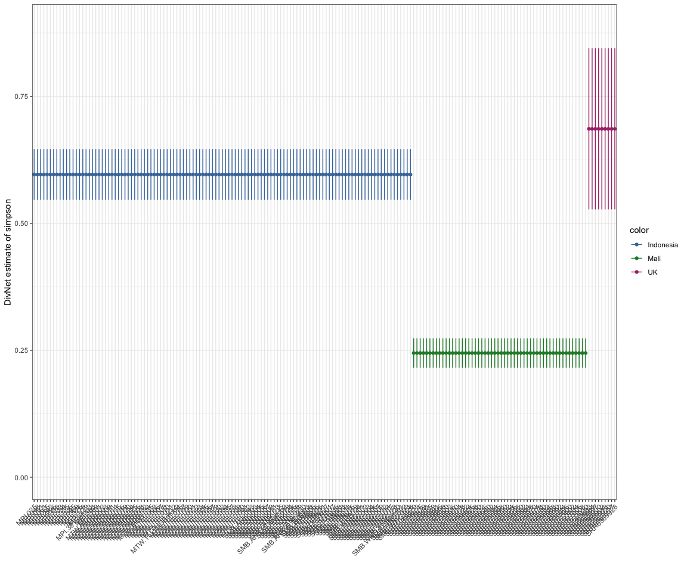

With the Simpson index, we see that the UK population has the highest
Simpson index (i.e., lowest diversity), followed by the Indonesian
population, then the Malian population.

Again, let’s test this formally.

``` r
testDiversity(dv_pop_comparison_cov, "simpson")
```

    ## Hypothesis testing:
    ##   p-value for global test: 0

    ##                  Estimates Standard Errors p-values
    ## (Intercept)     0.59607890     0.001495569    0.000
    ## predictorsMali -0.35159916     0.001967176    0.000
    ## predictorsUK    0.08983263     0.026431133    0.001

The result tells us that the mean Simpson diversity index in the
Indonesian population at the Phylum-level is 0.6, and it is
significantly lower by 0.35 orders, on average, in the Malian
population. We can also see that the UK population is significantly
higher than the Indonesian population by 0.09 orders, on average.

# Beta Diversity

Beta diversity is a measure of dissimilarity metric between samples to
compare differneces in species composition. It’s helpful to know not
only how taxonomically/pathogenically rich each sample is, but also to
see differences in samples and populations.

There are multiple beta diversity measures to use, including Bray-curtis
dissimilarity (based on abundances), Jaccard distance (based on presence
or absence), Euclidean distance, and Unifrac (based on sequence
distances using a phylogenetic tree).

The Bray–Curtis dissimilarity metric is probably the most popular beta
diversity metric and is bounded between 0 and 1, where 0 means the two
sites have the same composition (all species are shared), and 1 means
the two sites do not share any species.

Unlike alpha diversity, beta diversity is not as sensitive to
singletons, and it has even been suggested that ‘using simple
proportions’ (i.e., relative abundance) on non-rarefied data [is
fine](https://github.com/joey711/phyloseq/issues/470). I haven’t found
enough information on this one way or another (it seems like people are
far more opinionated on alpha diversity than beta diversity), but I
belive sticking with clr-transformed data is essential.

You can’t use negative values (which CLR has) for Bray-Curtis
dissimilarity, so therefore I’ll use Euclidean distances on
CLR-transformed data using the ordinate function from Phyloseq. Then,
I’ll compare this to Bray-Curtis dissimilarity and Euclidean distances
calculated in DivNet.

``` r
# Change counts to relative abundances
ps4.rel <- microbiome::transform(merged_phylo_counts_withSingletons, "clr")
# calculat Euclidean distances
bx.ord_pcoa_eucl <- ordinate(ps4.rel, method="PCoA", distance="euclidean")

# Make an ordination plot using euclidean distances
beta.ps1 <- plot_ordination(ps4.rel, 
                            bx.ord_pcoa_eucl, 
                            color="SamplePop", 
                            label = "SampleName") + 
  geom_point(aes(), size= 4) + 
  theme(plot.title = element_text(hjust = 0, size = 12))

# add in an ellipse
beta.ps1 + stat_ellipse() + theme_bw(base_size = 14) + 
  theme(panel.grid.major = element_blank(), panel.grid.minor = element_blank()) +
  scale_colour_manual(values=c(IndonesiaCol,MaliCol,UKCol))
```

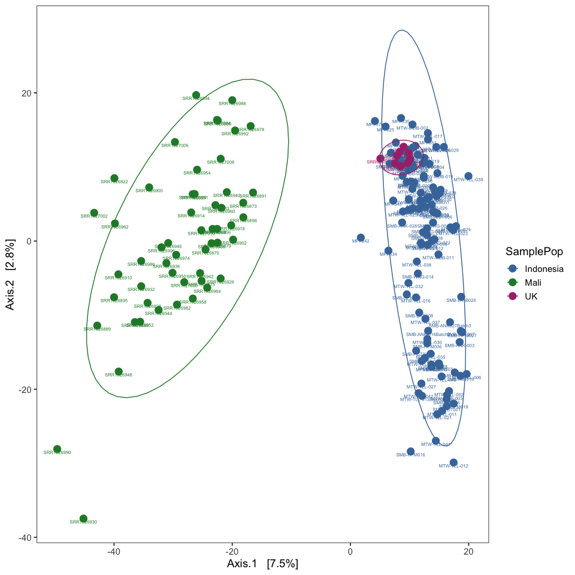

Using Euclidean distances on the CLR-transformed data, we can see that
the Malian data is the least similar from the Indonesian and UK data. We
can also see that the UK samples cluster inside the Indonesian samples
(I’m not sure how to interpret this).

Now let’s use our results from DivNet, which corrects for sequencing
depth, and see how this compares.

For the first bray-curtis dissimilarity analysis, we’ll look at all of
our samples individually, then we’ll look at how bray-curtis
dissimilarity looks like between islands (with hypothesis
testing).

``` r
# First, let's look at Bray-curtis dissimilarity at the individual sample level
bray_est <- simplifyBeta(dv_pop_comparison, pop_comparison, "bray-curtis", "SamplePop")

# add in group comparisons and plot
bray_est$group=paste(bray_est$Covar1,bray_est$Covar2,sep="_")
ggplot(bray_est, aes(x = interaction(Covar1, Covar2), y = beta_est, fill=group)) +
  geom_violin(alpha=0.7) + geom_boxplot(width=0.1) + xlab("Population Comparisons") + 
  theme(legend.position="none") + ggtitle("Bray-Curtis Distance Estimate") +
  ylab("Bray-Curtis Distance")
```

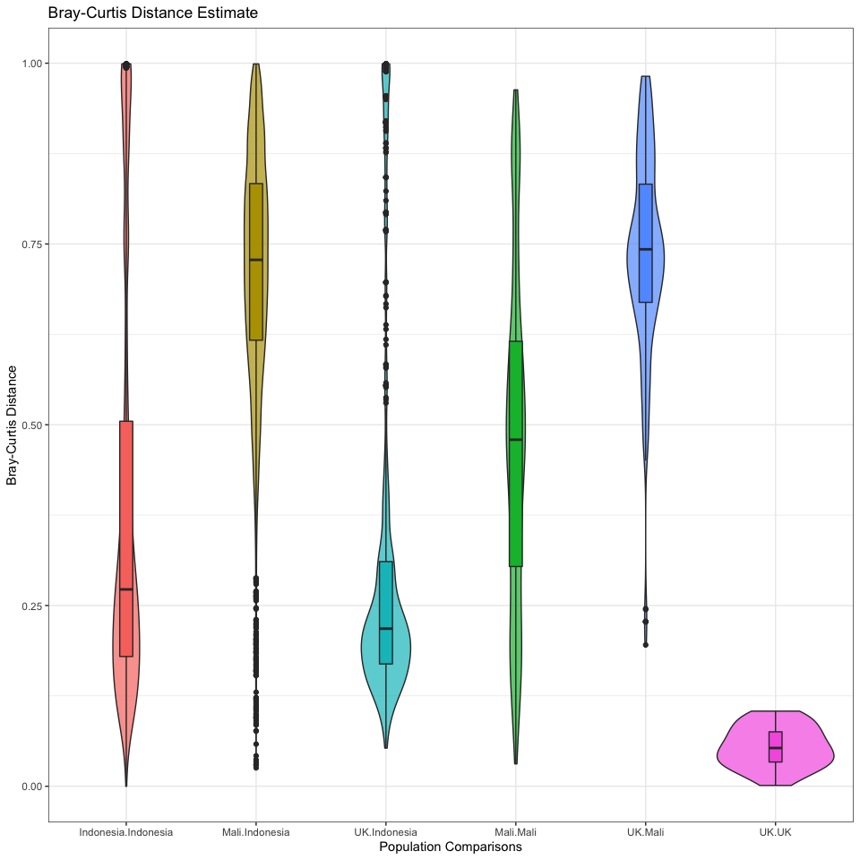

From DivNet, again we can see that the greatest dissimilarity is between
the Malian population, particularly the UK versus Malia. Unsurpiringly,
the least dissimilar samples are comparing populations to themselves (UK
samples to UK samples and Indonesian samples to Indonesian samples),
with the exception of the Malian samples. When comparing beta diversity
within the Malian samples, we can see that the mean Bray-Curtis
dissimilarity estimate is nearly 0.5, which is even higher than UK
samples compared to Indonesian samples. We also see quite a but of
spread in distance estimates when comparing populations to the
Indonesian or Malian samples.

Now let’s test beta diversity in DivNet using Euclidean
distance.

``` r
# First, let's look at Bray-curtis dissimilarity at the individual sample level
bray_est_eucl <- simplifyBeta(dv_pop_comparison, pop_comparison, "euclidean", "SamplePop")

# add in group comparisons and plot
bray_est_eucl$group <- paste(bray_est_eucl$Covar1, bray_est_eucl$Covar2,sep="_")

ggplot(bray_est_eucl, aes(x = interaction(Covar1, Covar2), y = beta_est, fill=group)) +
  geom_violin(alpha=0.7) + geom_boxplot(width=0.1) + xlab("Population Comparisons") + 
  theme(legend.position="none") + ggtitle("Euclidean Distance Estimate") +
  ylab("Euclidean Distance")
```

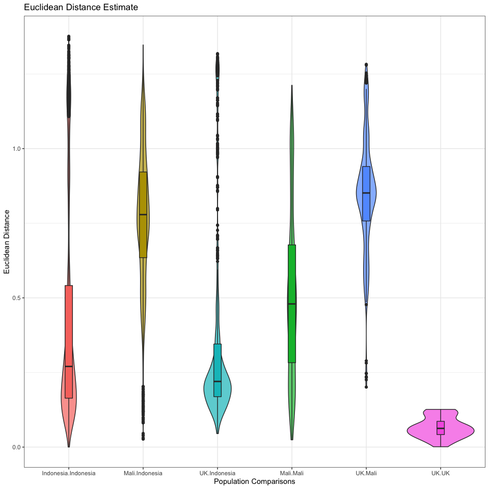

We can see very similar trends in using Euclidean distance, compared to
the Bray-Curtis dissimilarity metric.

Now let’s see how this looks like for island-level comparisons.

``` r
# Bray-Curtis dissimilarity
simplifyBeta(dv_pop_comparison_cov, pop_comparison, "bray-curtis", "SamplePop") %>%
  ggplot(aes(x = interaction(Covar1, Covar2), 
             y = beta_est)) +
  geom_point() +
  geom_linerange(aes(ymin = lower, ymax = upper)) + 
  theme(axis.text.x = element_text(angle = 45, hjust = 1)) +
  xlab("") + ylab("Estimates of Bray-Curtis distance")
```

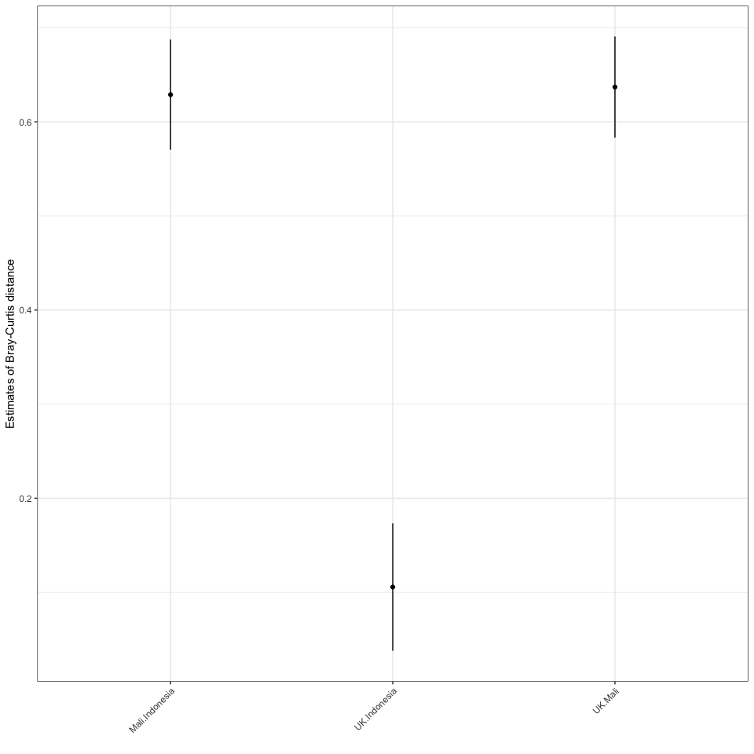

``` r
# Euclidean distance
simplifyBeta(dv_pop_comparison_cov, pop_comparison, "euclidean", "SamplePop") %>% filter(beta_var != 0) %>% 
  ggplot(aes(x = interaction(Covar1, Covar2), 
             y = beta_est)) +
  geom_point() +
  geom_linerange(aes(ymin = lower, ymax = upper)) + 
  theme(axis.text.x = element_text(angle = 45, hjust = 1)) +
  xlab("") + ylab("Estimates of Bray-Curtis distance")
```

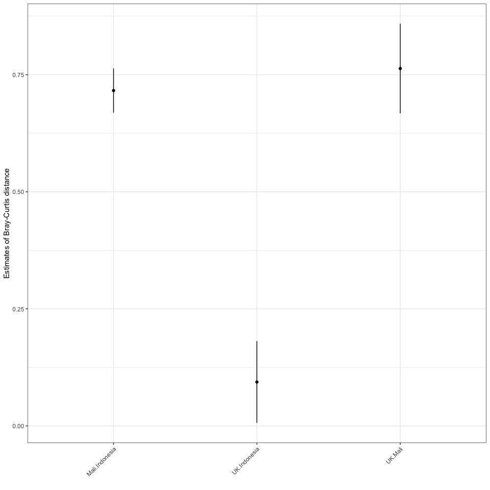

This confirms that indeeed, the Malian population is the most dissimilar
from the other two populations.
