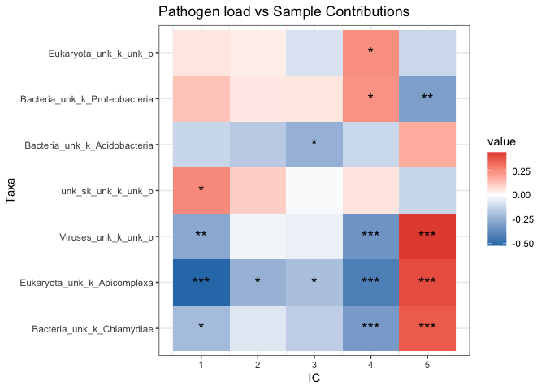

ICA Analysis for Indonesia Samples
================
katalinabobowik
2020-10-22

Last updated: 2020-10-29

# Introduction

In this analysis, I’ll be running ICA on the Indonesian dataset in order
to tease apart the contribution of genes and pathogens to expression
levels. The transcriptome is influenced by various environmental
factors, and here we’re interested in how microorganisms influence the
Indonesian tanscriptomes. ICA has been proposed as a method to
deconvolute the data, where the aim is to extract source signals from
the data. While PCA maximizes the variance in the data, ICA optimizes
higher-order statistics such as kurtosis (kurtosis measures extreme
values in either tail). In other words, PCA is ideal for when you want
to represent your data into reduced ranks, or compress data, while ICA
represents data as independent sub-elements (i.e., separates the data).

And that’s exactly what we want to do in this analysis\! We’re trying to
unmix our data to identify which pathogens and genes are contributing to
our expression levels.

To back this up, several previous studies have highlighted the
outperformance of ICA over PCA in obtaining a more realistic
decomposition of the expression data (see [Lee and
Batzoglou](https://www.ncbi.nlm.nih.gov/pmc/articles/PMC329130/), [Saidi
et al.](https://www.nature.com/articles/1207562), [Frigyesi et
al.](https://bmcbioinformatics.biomedcentral.com/articles/10.1186/1471-2105-7-290)).

Let’s start by loading in our packages and setting everything up.

# Loading packages and colour setup

The code below will install the packages needed to run the analysis.
We’re also setting up our directories to run locally, but I’ve
provided all of the paths so they can be easily modified if they need to
be run on the server.

``` r
library(Biobase)
library(plyr)
library(ggplot2)
library(foreach)
library(xtable)
library(biomaRt)
library(GOstats)
library(cluster)
library(marray)
library(mclust)
library(RColorBrewer)
library(igraph)
library(Rgraphviz)
library(graph)
library(colorspace)
library(annotate)
library(scales)
library(gtools)
library(JADE)
library(edgeR)
library(limma)
library(MineICA)
library(ade4)
library(ComplexHeatmap)
library(circlize)
library(polycor)
library(ggpubr)
library(reshape2)
library(phyloseq)
library(goseq)
library(KEGGREST)

# Set paths:
inputdir = "/Users/katalinabobowik/Documents/UniMelb_PhD/Analysis/UniMelb_Sumba/Output/DE_Analysis/123_combined/dataPreprocessing/"
otuDir = "/Users/katalinabobowik/Documents/UniMelb_PhD/Analysis/UniMelb_Sumba/Output/Epi_Study/SEIndonesianSamples/"
outputdir = "/Users/katalinabobowik/Documents/UniMelb_PhD/Analysis/UniMelb_Sumba/Output/Epi_Study/"

# Set up colour schemes
KorowaiCol="#F21A00"
MentawaiCol="#3B9AB2"
SumbaCol="#EBCC2A"
```

# Data preprocessing

To perform the IC analysis, we’ll be using the package MineICA, which is
a Bioconductor package that supplies a framework and storage for IC
analysis. Ultimately to perform the IC analysis, we need an object
containing our normalised (log2-CPM), batch-corrected data, as well as
our normalised OTU data.

Let’s load in the expression data, as well as our CLR-normalised OTU
data.

``` r
# load expression data and OTU file
load(paste0(inputdir, "indoRNA.read_counts.TMM.filtered.Rda"))
# load(paste0(otuDir,"relative_phyloCounts_compositional_filtered.Rda"))
load(paste0(otuDir,"relative_phyloCounts_clr_filtered.Rda"))
```

The OTU data is currently at the species level, but we want to analyse
this at the phylum level. We’ll therefore merge the data at the phylum
level using the tax\_glom function from Phyloseq. We’ll also assign
unique taxa names to each species and then turn the OTU data into a
dataframe.

``` r
# merge taxa to family level
relative_phyloCounts_clr <- relative_phyloCounts_clr %>%
  tax_glom("Phylum")

# assign unique taxa names to phyloseq object
taxa_names(relative_phyloCounts_clr) <- paste(tax_table(relative_phyloCounts_clr)[,"Superkingdom"], tax_table(relative_phyloCounts_clr)[,"Kingdom"], tax_table(relative_phyloCounts_clr)[,"Phylum"], sep="_")

OTUs = as.data.frame(otu_table(relative_phyloCounts_clr))
# transform OTU file to make it the same configuration as the expression list
OTUs=t(OTUs)
```

We want to append the OTU object to the expression dataframe, however
the expression data currently has all samples, including replicates,
whereas the OTU has replicates removed (we only kept replicates with the
highest taxa read depth). We’ll therefore take out the replicates from
the expression dataset and then append the OTU names.

``` r
# remove replicates from expression data frame
load(paste0(otuDir,"removeReplicates.Rda"))
removeReplicates <- gsub("Batch1", "_firstBatch", removeReplicates) %>% gsub("Batch2", "_secondBatch", .) %>% gsub("Batch3", "_thirdBatch", .)
y<-y[,-which(colnames(y) %in% removeReplicates)]

# check to see if samplenames in the OTU file are in the same order as the expression list before appending
samplenamesOTU <- as.character(rownames(OTUs))
samplenamesOTU <- gsub("\\.","-", samplenamesOTU)
samplenamesOTU <- gsub("Batch1","", samplenamesOTU)
samplenamesOTU <- gsub("Batch3","", samplenamesOTU)
samplenamesOTU <- gsub("Batch2","", samplenamesOTU)
samplenamesOriginal <- as.character(rownames(y$samples))
samplenamesOriginal <- sapply(strsplit(samplenamesOriginal, "[_.]"), `[`, 1)
identical(samplenamesOriginal,samplenamesOTU[match(samplenamesOriginal,samplenamesOTU)])
```

    ## [1] TRUE

``` r
# TRUE 

# match OTU data order to expression list oreder 
OTUs=OTUs[match(samplenamesOriginal,samplenamesOTU),]

# append to DGE list
for (name in colnames(OTUs)){
  y$samples[[paste0(name)]]<- OTUs[,name]
}
```

## Get batch-corrected data

We want batch-corrected expression data (that is, regressing out batch,
age, RIN, and blood cell type). We’ll do this by using the
removeBatchEffect function from
Limma.

``` r
# age is a variable we use in the model and NA values are not allowed. We'll replace NA with the mean age value
y$samples$Age[which(is.na(y$samples$Age) == T)]=45

# get batch-corrected data
lcpm <- cpm(y, log=TRUE)
design <- model.matrix(~0 + y$samples$Island)
# rename columns to be "Mentawai", "Sumba", and "Mappi"
colnames(design)=gsub("Island", "", colnames(design))
colnames(design)=gsub("y", "", colnames(design))
colnames(design)=gsub("samples", "", colnames(design))
colnames(design)=gsub("[\\$$]", "", colnames(design))
colnames(design)=gsub("West Papua", "Mappi", colnames(design))
# regress out variables influencing expression
batch.corrected.lcpm <- removeBatchEffect(lcpm, batch=y$samples$batch, covariates = cbind(y$samples$Age, y$samples$RIN, y$samples$CD8T, y$samples$CD4T, y$samples$NK, y$samples$Bcell, y$samples$Mono, y$samples$Gran), design=design)
```

Finally, before we run the IC analysis, we need to mean-center our data.

``` r
indoSampleSet <- t(apply(batch.corrected.lcpm,1,scale,scale=FALSE))
colnames(indoSampleSet) <- colnames(y)
```

# Running ICA using JADE

There are two algorithms you can choose for IC analysis in MineICA:
FastICA, and Jade. Jade (Joint Approximation Diagonalization of
Eigenmatrices), is faster and more accurate than FastICA, as FastICA
relies on random initializations and has been shown to be [more variable
with its
results](https://www.sciencedirect.com/science/article/pii/S0165993613001222).

Another thing we need to choose is the number of independent components.

For every sample, ICA models the level of expression for each gene as a
linear weighted sum of several independent components, where each
component captures a process. The expression data matrix is therefore
decomposed into a number of components characterising activation
patterns across genes and samples.

A large number of components can be difficult to intepret, however we
also want enough ICs to investigate differnet signals. One method used
to determine the number of ICs is to use [principal componenent
analysis](https://ieeexplore.ieee.org/document/4288502). That is,
choosing the number of PCs which contribute the most variance to the
data. Let’s look at a scree plot of the batch-corrected data.

``` r
pca <- prcomp(t(batch.corrected.lcpm), scale=T, center=T)
pca.var <- pca$sdev^2/sum(pca$sdev^2)
var_explained_df <- data.frame(PC=paste0("PC",1:length(pca$sdev)), var_explained=pca.var)
var_explained_df$PC <- factor(var_explained_df$PC, levels=var_explained_df$PC)

ggplot(var_explained_df, aes(x=PC, y=cumsum(var_explained))) + geom_line() + geom_point(size=4) +
labs(title="Scree plot: PCA on scaled data") +
theme(axis.text.x = element_text(angle = 90, vjust = 0.5, hjust=1))
```

<!-- -->

We can see that the first 5 PCs capture the most variance (18% in PC1
down to 3.5% in PC5). All PCs after that contribute to a very small
amount of variance (less than 3%). We’ll therefore choose 5 independent
components.

``` r
resJade <- runICA(X=indoSampleSet, nbComp=5, method = "JADE", maxit=10000) 
```

Next, we need to give MineICA some parameters to perform decomposition.
We need to tell it what genes we deem significant (i.e., how many
standard deviations away from the mean will we consider a gene to be
significant). When applying ICA decomposition to genomic data, the
distribution of the gene projections on the ICs is expected to be
super-Gaussian: a large portion of genes follow a (super-)Gaussian curve
centered at zero and a small portion belongs to an outgrowth located on
the right and/or on the left hand side of the distribution. These are
the genes we’re interested in\! The default and recommended value is 3,
which we’ll stick with. We’ll also choose a p-value cut-off of
0.05.

``` r
params_build <- buildMineICAParams(resPath=paste0(outputdir,"ICA/"), selCutoff=3, pvalCutoff=0.05)
```

We also need to set up gene annotation, which we’ll do using Biomart
ENSEMBL gene IDs.

``` r
mart <- useMart(biomart="ensembl", dataset="hsapiens_gene_ensembl")
typeIDindoSampleSet <- c(geneID_annotation="SYMBOL", geneID_biomart="ensembl_gene_id", featureID_biomart="ensembl_gene_id")
```

Now, let’s run the
ICA.

``` r
# define the reference samples if any, here no normal sample is available
refSamplesindoSampleSet <- character(0)

# Run ICA using JADE 
rownames(resJade$A) = colnames(indoSampleSet)
resBuild <- buildIcaSet(params=params_build, A=data.frame(resJade$A), S=data.frame(resJade$S), dat=indoSampleSet, pData=y$samples, typeID= typeIDindoSampleSet, refSamples=refSamplesindoSampleSet, mart=mart)
```

# Exploring the IcaSet

Inside the ICA decomposition are two matrices: A, a matrix with sample
contributions, and S, a matrix containing gene projections. Let’s see
how these look like.

``` r
icaSetIndo <- resBuild$icaSet
head(A(icaSetIndo))
```

    ##                             1           2           3           4         5
    ## MPI-025_firstBatch -0.1766112 -0.14479033 -0.22520063 -0.00204636 0.2273684
    ## MPI-048_firstBatch -0.2210093  0.20318579 -0.12283798 -0.20715603 0.4095205
    ## MPI-051_firstBatch -0.1801079  0.08427408 -0.08309298 -0.20572326 0.2846653
    ## MPI-061_firstBatch -0.1119208 -0.04887758 -0.13151179 -0.14432779 0.1370467
    ## MPI-065_firstBatch -0.1542842  0.03628578  0.09369314 -0.24526670 0.2362722
    ## MPI-242_firstBatch -0.1926978 -0.10261750 -0.23551598 -0.17944622 0.2510944

``` r
head(S(icaSetIndo))
```

    ##                          1           2          3          4          5
    ## ENSG00000228794  1.2541558  0.63896595  1.7952166 -0.0812304 -0.2029312
    ## ENSG00000188976  0.2057648 -0.03179361 -0.5509841  0.4142459  0.5130656
    ## ENSG00000187961  1.2342116  1.49229123 -0.5282961  0.1034631  1.6156740
    ## ENSG00000188290 -1.0548505 -3.55894560 -0.1890363 -3.7640405 -1.2592752
    ## ENSG00000187608  0.0518752 -2.40235814 -0.3846139 -6.8718266 -1.9051068
    ## ENSG00000188157 -0.1072705 -2.11231868 -0.6458266 -3.1247160  0.5932686

Let’s talk about each of these, one by one. In the S matrix, we have a
data frame where each genes is a row with a projection corresponding to
it (one projection for every gene in every component). What do these
projections mean? Genes with larger projections have larger
contributions to that dimension, and therefore they’re the genes which
most strongly influence processes assocoiated with that component.

For the A data frame, we have weights for each sample (in rows), as well
as for each dimension (in columns). That weight, or contribution,
reflects the activity of the component in this sample. So samples can
have a positive or a negative contribution to the component.

# Investigating contributing genes

As stated earlier, when applying ICA decomposition to genomic data, the
distribution of the gene projections on the ICs is expected to be
super-Gaussian, while a small portion of genes belongs to the right or
left hand side of the distribution. Let’s take a look at the
contributing genes in the first
component.

``` r
hist(S(icaSetIndo)[,1], breaks=50, main="Distribution of feature projection on the first component", xlab="projection values") 
abline(v=c(3,-3), col="red", lty=2)
```

<!-- -->

From the histogram, you can see that the majority of genes are centered
around zero, however a small subset of the genes are 3 or more SD away.

We can view the list of these contributing genes by calling the
‘selectContrib’ function.

``` r
# Get genes driving variation in the first 5 PCs 
contrib <- selectContrib(icaSetIndo, cutoff=3, level="genes")
```

Or, for more detail, we can use the ‘writeProjByComp’ function. Let’s
look at some of the contributing genes in the first component.

``` r
params <- resBuild$params
resW <- writeProjByComp(icaSet=icaSetIndo, params=params, mart=mart, level='genes', selCutoffWrite=3)
head(resW$listAnnotComp[[1]])
```

    ##     ensembl_gene_id scaled_proj nbOcc_forThreshold:3 comp_forThreshold:3
    ## 148 ENSG00000180537        16.9                    2                 1,3
    ## 39  ENSG00000112139       14.02                    3               1,2,3
    ## 225 ENSG00000259385      -12.99                    1                   1
    ## 226 ENSG00000259488      -12.99                    1                   1
    ## 50  ENSG00000123838       11.89                    2                 1,4
    ## 216 ENSG00000254415      -10.06                    3               1,2,3
    ##     hgnc_symbol
    ## 148      RNF182
    ## 39        MDGA1
    ## 225            
    ## 226            
    ## 50        C4BPA
    ## 216    SIGLEC14
    ##                                                                                         description
    ## 148                                     ring finger protein 182 [Source:HGNC Symbol;Acc:HGNC:28522]
    ## 39  MAM domain containing glycosylphosphatidylinositol anchor 1 [Source:HGNC Symbol;Acc:HGNC:19267]
    ## 225                                                            novel transcript, antisense to CTXN2
    ## 226                                                              novel transcript, antisense to DUT
    ## 50                  complement component 4 binding protein alpha [Source:HGNC Symbol;Acc:HGNC:1325]
    ## 216                       sialic acid binding Ig like lectin 14 [Source:HGNC Symbol;Acc:HGNC:32926]
    ##     chromosome_name start_position end_position   band strand
    ## 148               6       13924446     13980310    p23      1
    ## 39                6       37630679     37699306  p21.2     -1
    ## 225              15       48192191     48201684  q21.1     -1
    ## 226              15       48312353     48331856  q21.1     -1
    ## 50                1      207104233    207144972  q32.2      1
    ## 216              19       51642553     51646801 q13.41     -1

In the first component, we can see genes like RNF182 have a large
positive projection while genes like SIGLEC14 have a large negative
projection. Both positive and negative signs are important but mean
different things - genes with positive projections are genes whose
expression are positively correlated with the direction of the samples
in that component, while opposite projection signs are genes whose
expression levels are anti-correlated with the samples in that
component.

It took me a while to figure this out, and that sentence still sounds
confusing, so let’s create a figure as an example. Let’s take the first
positive gene, RNF182.

``` r
# get the first component  of the sample weights df
sampleWeights_df <- data.frame(rownames(A(icaSetIndo)), A(icaSetIndo)[,1])
Island = sapply(strsplit(rownames(A(icaSetIndo)), "[-.]"), `[`, 1)
sampleWeights_df$Island <- Island
colnames(sampleWeights_df) <- c("samples", "weight", "Island")

ggplot(sampleWeights_df, aes(x=Island, y=weight, fill=Island)) + geom_violin() + theme_bw() + scale_fill_manual(values=c(KorowaiCol,MentawaiCol,SumbaCol)) + ggtitle("Contribution to IC1") + geom_boxplot(width=0.1)
```


We can see that Korowai samples have a negative contribution to
component 1, while on average, Mentawai and Sumba have a positive
contribution. Therefore, RNF182 should be more highly upregulated in
Mentawai and Sumba, on average, than Korowai. Let’s check.

``` r
expression_df <- data.frame(lcpm["ENSG00000180537",], y$samples$Island)
colnames(expression_df) <- c("Expression", "Island")
expression_df$Island <- factor(expression_df$Island, levels=c("West Papua", "Mentawai", "Sumba"))

ggplot(expression_df, aes(x=Island, y=Expression, fill=Island)) + geom_violin() + theme_bw() + scale_fill_manual(values=c(KorowaiCol,MentawaiCol,SumbaCol)) + ggtitle("RNF182 (Positive Projection)") + geom_boxplot(width=0.1)
```


Great, my understanding holds up. Now let’s check it for a negative
gene.

``` r
expression_df <- data.frame(lcpm["ENSG00000254415",], y$samples$Island)
colnames(expression_df) <- c("Expression", "Island")
expression_df$Island <- factor(expression_df$Island, levels=c("West Papua", "Mentawai", "Sumba"))

ggplot(expression_df, aes(x=Island, y=Expression, fill=Island)) + geom_violin() + theme_bw() + scale_fill_manual(values=c(KorowaiCol,MentawaiCol,SumbaCol)) + ggtitle("SIGLEC14 (Negative Projection)") + geom_boxplot(width=0.1)
```


Because the negative projections are anti-correlated, negatively
correlated samples to the component will have a positive value of the
negative projection genes.

Let’s also go over what each of the column names mean in this
    file.

``` r
colnames(resW$listAnnotComp[[1]])
```

    ##  [1] "ensembl_gene_id"      "scaled_proj"          "nbOcc_forThreshold:3"
    ##  [4] "comp_forThreshold:3"  "hgnc_symbol"          "description"         
    ##  [7] "chromosome_name"      "start_position"       "end_position"        
    ## [10] "band"                 "strand"

We can see that we have some descriptive output, such as the ENSEMBL
gene name, HGNC symbol, description, etc., but two other columns stand
out that might not be as intuitive: nbOcc\_forThreshold:3 and
"comp\_forThreshold:3. The first one, nbOcc\_forThreshold:3, gives us
the number of components that the gene in that row had a scaled,
absolute projection over 3 for. The second value then gives you which
columns this gene appears in.

# Testing similarities between DE genes and significant IC genes

One thing we might want to know is what the overlap is between
differentially expressed genes we previously found in study one versus
genes contributing to each component in the IC analysis. Let’s do that
by getting all genes from the DE analysis. We’ll only get genes which
are DE at an adjusted p-value of 0.05 and no log fold change threshold.

``` r
# Get DE genes for each island
SMBvsMPI=read.table("/Users/katalinabobowik/Documents/UniMelb_PhD/Analysis/UniMelb_Sumba/Output/DE_Analysis/123_combined/DE_Island/LM_allCovarPlusBlood/topTable_SMBvsMPI.txt")
MTWvsMPI=read.table("/Users/katalinabobowik/Documents/UniMelb_PhD/Analysis/UniMelb_Sumba/Output/DE_Analysis/123_combined/DE_Island/LM_allCovarPlusBlood/topTable_MTWvsMPI.txt")
SMBvsMTW=read.table("/Users/katalinabobowik/Documents/UniMelb_PhD/Analysis/UniMelb_Sumba/Output/DE_Analysis/123_combined/DE_Island/LM_allCovarPlusBlood/topTable_SMBvsMTW.txt")
```

Now let’s see the percentage of overlap for each IC.

``` r
# get barplots of proportion of contributing genes in each IC
contributingGenes=matrix(nrow=3,ncol=5)
rownames(contributingGenes)=c("SMBvsMPI","MTWvsMPI","SMBvsMTW")
colnames(contributingGenes)=c("IC1","IC2","IC3","IC4","IC5")
for (i in 1:5){
  contributingGenes["SMBvsMPI",i]=length(contrib[[i]][which(names(contrib[[i]]) %in% rownames(SMBvsMPI))])
  contributingGenes["MTWvsMPI",i]=length(contrib[[i]][which(names(contrib[[i]]) %in% rownames(MTWvsMPI))])
  contributingGenes["SMBvsMTW",i]=length(contrib[[i]][which(names(contrib[[i]]) %in% rownames(SMBvsMTW))])
}
contributingGenes=as.data.frame(contributingGenes)
contributingGenes$type="contribGenes"
contributingGenes$Island=rownames(contributingGenes)

# add in DE genes
deGenes=do.call("cbind", replicate(5, c(nrow(SMBvsMPI),nrow(MTWvsMPI),nrow(SMBvsMTW)), simplify = FALSE))
deGenes=as.data.frame(deGenes)
rownames(deGenes)=c("SMBvsMPI","MTWvsMPI","SMBvsMTW")
colnames(deGenes)=c("IC1","IC2","IC3","IC4","IC5")
deGenes$type="deGenes"
deGenes$Island=rownames(deGenes)
allGenes=rbind(contributingGenes,deGenes)
meltedGenes=melt(allGenes)
# reorder
meltedGenes$type=factor(meltedGenes$type, levels=c("deGenes","contribGenes"))

ggplot(meltedGenes, aes(x = Island, y = value, fill = type)) + 
  geom_bar(stat = 'identity', position = 'fill') + facet_grid(~ variable) + theme_bw() + 
  theme(axis.title.x=element_blank(), axis.text.x = element_text(angle = 90)) +
  scale_fill_manual(values = c("#4477AA","#EE6677"))
```


We can see that there’s a small overlap in genes, which is particularly
apparent in the first four ICs. Now let’s look at the amount of overlap
between genes at an adjusted p-value of 0.05 and a LFC threshold of 1.

``` r
# Only get genes with a LFC of one and a pvalue of 0.05
SMBvsMPI_genes=rownames(SMBvsMPI)[which(abs(SMBvsMPI$logFC) >= 1)]
MTWvsMPI_genes=rownames(MTWvsMPI)[which(abs(MTWvsMPI$logFC) >= 1)]
SMBvsMTW_genes=rownames(SMBvsMTW)[which(abs(SMBvsMTW$logFC) >= 1)]

# get barplots of proportion of contributing genes in each IC
contributingGenes=matrix(nrow=3,ncol=5)
rownames(contributingGenes)=c("SMBvsMPI","MTWvsMPI","SMBvsMTW")
colnames(contributingGenes)=c("IC1","IC2","IC3","IC4","IC5")
for (i in 1:5){
  contributingGenes["SMBvsMPI",i]=length(contrib[[i]][which(names(contrib[[i]]) %in% SMBvsMPI_genes)])
  contributingGenes["MTWvsMPI",i]=length(contrib[[i]][which(names(contrib[[i]]) %in% MTWvsMPI_genes)])
  contributingGenes["SMBvsMTW",i]=length(contrib[[i]][which(names(contrib[[i]]) %in% SMBvsMTW_genes)])
}
contributingGenes=as.data.frame(contributingGenes)
contributingGenes$type="contribGenes"
contributingGenes$Island=rownames(contributingGenes)

# add in DE genes
deGenes=do.call("cbind", replicate(5, c(length(SMBvsMPI_genes),length(MTWvsMPI_genes),length(SMBvsMTW_genes)), simplify = FALSE))
deGenes=as.data.frame(deGenes)
rownames(deGenes)=c("SMBvsMPI","MTWvsMPI","SMBvsMTW")
colnames(deGenes)=c("IC1","IC2","IC3","IC4","IC5")
deGenes$type="deGenes"
deGenes$Island=rownames(deGenes)
allGenes=rbind(contributingGenes,deGenes)
meltedGenes=melt(allGenes)
# reorder
meltedGenes$type=factor(meltedGenes$type, levels=c("deGenes","contribGenes"))

ggplot(meltedGenes, aes(x = Island, y = value, fill = type)) + 
  geom_bar(stat = 'identity', position = 'fill') + facet_grid(~ variable) + theme_bw() + 
  theme(axis.title.x=element_blank(), axis.text.x = element_text(angle = 90)) +
  scale_fill_manual(values = c("#4477AA","#EE6677"))
```


We can see that at a LFC threshold of 1, there’s now a much bigger
overlap. Again, we see this more so in ICs 1-4, with IC1 reaching over
25% overlap between all population comparisons.

# GO analysis of contributing genes

We’ve seen that there genes contributing to each independent component,
and some of these genes overlap with DE genes. But what are they
actually doing? IC analysis pulls out biological signals from the data,
which corresponds to a component. Therefore, we can plug all of the
contributing genes into a GO/KEGG analysis to see what pathways they’re
involved in. We’ll do this using
[GoSeq](https://genomebiology.biomedcentral.com/articles/10.1186/gb-2010-11-2-r14),
which corrects for gene length bias.

``` r
# gene set testing with goSeq
for(dim in 1:4){
      # set up gene universe
      gene.vector=as.integer(rownames(y) %in% names(contrib[[dim]]))
      names(gene.vector)=rownames(y)

      # implement a weight for each gene dependent on its length
      pwf=nullp(gene.vector,"hg19","ensGene",plot.fit=FALSE)
      # use  the  default  method  to  calculate  the  over  and  under  expressed  GO categories among DE genes
      GO.wall=goseq(pwf,"hg19","ensGene",use_genes_without_cat=TRUE)

      # apply a multiple hypothesis testing correction set at 0.05% (BH method)
      enriched.GO=GO.wall[p.adjust(GO.wall$over_represented_pvalue, method="BH")<=0.05,]
      #write.table(enriched.GO, file=paste0(outputdir,"EnrichedGOterms_ContributingGenes_LFC0.05_dim",dim,".txt"), quote=F, row.names=F)
      
      # plot
      enriched_BP <- enriched.GO[which(enriched.GO$ontology=="BP"),c("term","over_represented_pvalue")]
      enriched_BP$term <- factor(enriched_BP$term, levels=enriched_BP$term)
      print(ggplot(enriched_BP, aes(x=rev(term), y=-log10(over_represented_pvalue))) + 
        geom_point(stat='identity', aes(alpha=0.7), colour="#004488", size=5)  +
        coord_flip() + theme_bw() + ylab("-log10 BH-adjusted p-value") + xlab("GO Term") + 
        ggtitle(paste0("Enriched BP Go Terms, IC",dim)) + theme(legend.position = "none")) 
}
```


Each plot is showing an enriched, biological process (BP) GO term on the
y axis, along with its BH-adjusted, -log10 pvalue on the y axis. In IC1,
we can see the immune response being kickstarted by activation of
leokocytes/immune cells (myeloid cell activation involved in immune
response, granulocyte activation, neutrophil activation, leukocyte
activation involved in immune response, cell activation involved in
immune response, etc.) In IC2, we can see immune-related processes, but
this time in the context of cell activation, cell movement, and cell
proliferation. In IC3, we see many biological porcesses involved in
chemical reactions and pathways involving heme. Heme is an essential
cofactor for aerobic organisms, and in blood stages, [malaria parasites
consume most of the hemoglobin inside infected
erythrocytes](https://www.ncbi.nlm.nih.gov/pmc/articles/PMC4263882/). In
IC4, we see many viral pathways (defense response to virus, regulation
of viral genome replication, positive regulation of defense response to
virus by host), and finally in IC5, we have no enriched GO terms.

Now let’s take a look at KEGG pathways.

``` r
for(dim in 1:4){
      gene.vector=as.integer(rownames(y) %in% names(contrib[[dim]]))
      names(gene.vector)=rownames(y)
      # KEGG pathway analysis
      en2eg=as.list(org.Hs.egENSEMBL2EG)
      # Get the mapping from Entrez 2 KEGG
      eg2kegg=as.list(org.Hs.egPATH)
      # Define a function which gets all unique KEGG IDs
      # associated with a set of Entrez IDs
      grepKEGG=function(id,mapkeys){unique(unlist(mapkeys[id],use.names=FALSE))}
      # Apply this function to every entry in the mapping from ENSEMBL 2 Entrez to combine the two maps
      kegg=lapply(en2eg,grepKEGG,eg2kegg)
      # produce PWF as before
      pwf=nullp(gene.vector,"hg19","ensGene", plot.fit=FALSE)
      KEGG=goseq(pwf,gene2cat=kegg, use_genes_without_cat=TRUE)
      enriched.GO.kegg=KEGG[p.adjust(KEGG$over_represented_pvalue, method="BH")<.05,]
      enriched.GO.kegg$category <- paste0("hsa",enriched.GO.kegg$category)
      if (length(enriched.GO.kegg$category) > 0){
        query <- keggGet(enriched.GO.kegg$category)
        KEGG_Term <- lapply(1:length(enriched.GO.kegg$category), function(x) unname(query[[x]]$PATHWAY_MAP))
        enriched.GO.kegg$Term <- unlist(KEGG_Term) 
        print(enriched.GO.kegg$Term)
      }
      write.table(enriched.GO.kegg, file=paste0(outputdir,"EnrichedGOkegg_ContributingGenes_LFC0.05_dim",dim,".txt"))
}
```

    ## [1] "Cell adhesion molecules"
    ## [1] "Neuroactive ligand-receptor interaction"        
    ## [2] "Arrhythmogenic right ventricular cardiomyopathy"
    ## [3] "Hematopoietic cell lineage"                     
    ## [4] "Cytokine-cytokine receptor interaction"         
    ## [5] "Tryptophan metabolism"                          
    ## [6] "Hypertrophic cardiomyopathy"                    
    ## [7] "Protein digestion and absorption"               
    ## [8] "Dilated cardiomyopathy"                         
    ## [1] "Malaria"
    ## [1] "Hepatitis C"                          
    ## [2] "RIG-I-like receptor signaling pathway"
    ## [3] "Cytosolic DNA-sensing pathway"

In IC1, we have “Cell adhesion molecules” as an enriched pathway.
According to
[KEGG](https://www.genome.jp/dbget-bin/www_bget?pathway+hsa04514): “Cell
adhesion molecules (CAMs) are (glyco)proteins expressed on the cell
surface and play a critical role in a wide array of biologic processes
that include hemostasis, the immune response, inflammation,
embryogenesis, and development of neuronal tissue.” Interestingly, this
is super important for malaria: “Adhesion of erythrocytes infected with
Plasmodium falciparum to human cells has a key role in the pathogenesis
of life-threatening malaria”, as per this paper:
<https://www.ncbi.nlm.nih.gov/pmc/articles/PMC2878476/>.

In IC2, we see “Neuroactive ligand-receptor interaction”,
“Arrhythmogenic right ventricular cardiomyopathy”, “Hematopoietic cell
lineage”, “Cytokine-cytokine receptor interaction”, “Tryptophan
metabolism”, “Hypertrophic cardiomyopathy”, “Protein digestion and
absorption”, and “Dilated cardiomyopathy”. So I see two signals here
from the KEGG pathways: heart-related myopathies, and cytokine
activation. I really don’t know what the heart signals could be from but
here’s some more info on teh cytokine response from
[KEGG](https://www.google.com/search?client=firefox-b-d&biw=1807&bih=985&sxsrf=ALeKk03PS9YmgukUQdXocb4hD2qskN_BTw%3A1603859984190&ei=EPaYX8mQC83az7sPzrSX8AU&q=heart+myopathies&oq=heart+myopathies&gs_lcp=CgZwc3ktYWIQAzIGCAAQBxAeMgQIABAeMgYIABAIEB4yBggAEAgQHjIGCAAQCBAeOgQIABBHUMVBWMJEYOlGaABwAngBgAHWAogB4gqSAQUyLTMuMpgBAKABAaoBB2d3cy13aXrIAQjAAQE&sclient=psy-ab&ved=0ahUKEwjJ2IGFvNbsAhVN7XMBHU7aBV4Q4dUDCAw&uact=5):
“Cytokines are released by various cells in the body, usually in
response to an activating stimulus, and they induce responses through
binding to specific receptors on the cell surface of target cells.”

In IC3, we have the malaria pathway being enriched, which matches up
with the enrcihed heme signatures we were seeing in the GO analysis.

Finally in IC4, we have “Hepatitis C”, “RIG-I-like receptor signaling
pathway”, and “Cytosolic DNA-sensing pathway”. For the RIG signaling
pathway, this is what
[KEGG](https://www.genome.jp/dbget-bin/www_bget?hsa04622) says:
“Specific families of pattern recognition receptors are responsible
for detecting viral pathogens and generating innate immune responses.
Non-self RNA appearing in a cell as a result of intracellular viral
replication is recognized by a family of cytosolic RNA helicases termed
RIG-I-like receptors (RLRs). The RLR proteins include RIG-I, MDA5, and
LGP2 are expressed in both immune and nonimmune cells. Upon recognition
of viral nucleic acids, RLRs recruit specific intracellular adaptor
proteins to initiate signaling pathways that lead to the synthesis of
type I interferon and other inflammatory cytokines, which are important
for eliminating viruses.” The Cytosolic DNA-sensing pathway and
Hepatitis C pathways also suggest viral invasion.

No enriched KEGG pathways were found in IC5.

# Association with sample variables

## Qualitative variable analysis

It looks like we’re getting some interesting signals, but now let’s tie
this together with our samples. One of the questions we’re interested in
asking is whether or not there’s a difference between island populations
in the genes they contribute to each IC. We can look at this by testing
whether island populations are differently distributed on the components
in terms of their contribution value.

Let’s test this using a Kruskal-Wallis test.

``` r
resQual <- qualVarAnalysis(params=params, icaSet=icaSetIndo, 
                           keepVar=c("Island"),
                           adjustBy="variable", doPlot=T,
                           path="qualVarAnalysis/", typePlot="boxplot",filename="qualVar")
```

``` r
for (i in 1:5){
  IC=data.frame(A(icaSetIndo)[[i]],pData(icaSetIndo)[,"Island"])
  colnames(IC)=c("Sample_Contribution","Island")
  pval=unname(resQual["Island",][i])
  print(ggplot(IC, aes(x=Island,y=Sample_Contribution,fill=Island)) + geom_violin() + geom_boxplot(width=0.1) + labs(x = "Island", y = "Sample Contribution", subtitle=paste0("p = ",pval)) + theme_bw() + 
  scale_fill_manual(values=c(MentawaiCol,SumbaCol,KorowaiCol)) +
  ggtitle(paste0("Island Contributions in IC",i)))
}
```


Neat, all of the ICs are significant after p-value adjustment for
multiple testing. In IC1, we can see that the Korowai is negatively
driving the signal. In IC2, Mentawai is positively driving the signal.
In PC3, Sumba seems to be positively driving the signal, in IC4, Sumba
(positively) and Korowai (negatively) are driving the signal, and in
IC5, Korowai is positively driving the signal.

## Quantitative variable analysis

Now we can perform a quantitative variable analysis on the pathogen
load. Here, we’ll compute the pearson correlation between pathogen load
and the sample contributions and only report pathogens that have a BH
adjusted p-value \<
0.05.

``` r
resQuant <- quantVarAnalysis(params=params, icaSet=icaSetIndo, keepVar=c(colnames(OTUs)), 
                             typeCor="pearson", cutoffOn="pval",
                             cutoff=0.05, adjustBy="variable",  
                             path="quantVarAnalysis/", filename="quantVar", doPlot=T)
```

The function resQuant saves all images to the path that you specify, so
the results can’t be seen here. However, I’ll output the results for
each significant pathogen in a heatmap.

``` r
pval <- resQuant$pval
pval$Pathogen <- rownames(pval)
melted_pval <- melt(pval)
sig_pathogen <- unique(melted_pval[which(melted_pval$value <= 0.05),"Pathogen"])
pval <- pval[sig_pathogen,]
pval$Pathogen <- NULL

# get Pearson correlation
correlation <- resQuant$cor
correlation <- correlation[sig_pathogen,]

# make a heatmap of the correlations
melted=melt(correlation)
melted_pval <- melt(pval)
melted$pval <- melted_pval$value
melted$significance <- ""
melted[which(melted$pval<0.05),"significance"] <- "*"
melted[which(melted$pval<0.01),"significance"] <- "**"
melted[which(melted$pval<0.001),"significance"] <- "***"

ggplot(melted, aes(x=Var2, y=Var1, fill=value)) + geom_tile() + scale_fill_gradient2(low="#2C7BB6", mid="white", high="#D7191C") + geom_text(aes(label=significance), color="black", size=5) + theme_bw() + 
  labs(x="IC", y="Taxa") + ggtitle("Pathogen load vs Sample Contributions")
```



You can easily recreate the output with ggplot to see some of the
results. Three pathogens - Plasmodium, Flavivirus and Chlamydieae - are
significant in the majority of the ICs. My previous pathogen analysis
showed that two pathogens, Flavivirus and Plasmodium, have a high
pathogen load in these populations. Thereofre, output the results for
both of these in each IC.

First, let’s look at Plasmodium.

``` r
for (i in 1:5){
  df=data.frame(A(icaSetIndo)[[i]],pData(icaSetIndo)[,"Eukaryota_unk_k_Apicomplexa"],rownames(A(icaSetIndo)))
  colnames(df)=c("sample_contribution","plasmo_load", "sample")
  df$Island <- sapply(strsplit(as.character(df$sample), "[-.]"), `[`, 1)
  pathogen="Plasmodium"
  print(ggplot(df, aes(x=sample_contribution, y=plasmo_load)) + 
    geom_point(aes(color = c(KorowaiCol,MentawaiCol,SumbaCol)[as.numeric(factor(Island))])) + labs(x = "Sample Contribution", y = paste(pathogen, "Load", sep=" ")) +
    geom_smooth(method="lm", se = FALSE) + theme_bw() + ggtitle(paste0(pathogen,", IC",i)) + geom_rug(color = c(KorowaiCol,MentawaiCol,SumbaCol)[as.numeric(factor(Island))]) + scale_color_manual(values=c(KorowaiCol,MentawaiCol,SumbaCol)) +
    stat_cor(method = "pearson") + scale_color_identity(name = "Island", guide = "legend", labels = c("Mentawai", "Sumba", "Korowai")))
}
```


Plasmodium has a significant correlation in every single component, with
ICs 1-4 having a significant negative correlation. If we look at the
correlation plots, we can see that in the Korowai is driving the IC,
where a higher plasmodium load correlates with a negative sample
contribution (from the Korowai).

If we tie this together with genes, we can look at some contributing
genes in the dimensions correlated with malaria. Clearly IC3 is drivem
by malaria, but I would say IC1 also has strong malaria-like signals. In
my DE analysis, one of the genes with the highest DE signals was MARCO,
a macrophage receptor gene involved in pathogen clearance. This is also
one of the highest contributing genes to IC1. Let’s plot the the density
of this gene between island populations using the batch-corrected data.

``` r
ICA_genes = batch.corrected.lcpm[c("ENSG00000019169"),]
ICA_genes <- melt(ICA_genes)
ICA_genes$Island <- sapply(strsplit(rownames(ICA_genes), "[-.]"), `[`, 1)

ggplot(ICA_genes, aes(x=Island, y=value, fill=Island)) + geom_violin() + theme_bw() + 
  scale_fill_manual(values=c(KorowaiCol,MentawaiCol,SumbaCol)) +  
  geom_boxplot(width=0.1) + ylab("Batch-corrected CPM") + ggtitle("MARCO")
```


In IC3, SLC4A1 is the gene with the highest contribution to the
component. This gene is associated with Southeast Asian Ovalocytosis, a
blood disorder common in Southeast Asia which us protective against
malaria. Although this gene was not found to be DE from my previous
study, let’s plot the density of this gene between island populations
using the batch-corrected data.

``` r
ICA_genes = batch.corrected.lcpm[c("ENSG00000004939"),]
ICA_genes <- melt(ICA_genes)
ICA_genes$Island <- sapply(strsplit(rownames(ICA_genes), "[-.]"), `[`, 1)

ggplot(ICA_genes, aes(x=Island, y=value, fill=Island)) + geom_violin() + theme_bw() + 
  scale_fill_manual(values=c(KorowaiCol,MentawaiCol,SumbaCol)) +  
  geom_boxplot(width=0.1) + ylab("Batch-corrected CPM") + ggtitle("SLC4A1")
```


Now let’s look into Flavivirus.

``` r
for (i in 1:5){
  df=data.frame(A(icaSetIndo)[[i]], pData(icaSetIndo)[,"Viruses_unk_k_unk_p"], rownames(A(icaSetIndo)))
  colnames(df)=c("sample_contribution","virus_load", "sample")
  df$Island <- sapply(strsplit(as.character(df$sample), "[-.]"), `[`, 1)
  pathogen="Flavivirus"
  print(ggplot(df, aes(sample_contribution,virus_load)) + geom_point(aes(color = c(KorowaiCol,MentawaiCol,SumbaCol)[as.numeric(factor(Island))])) + labs(x = "Sample Contribution", y = paste(pathogen, "Load", sep=" ")) +
    geom_smooth(method="lm", se = FALSE) + theme_bw() + ggtitle(paste0(pathogen,", IC",i)) + geom_rug(color = c(KorowaiCol,MentawaiCol,SumbaCol)[as.numeric(factor(Island))]) +
    stat_cor(method = "pearson") + scale_color_identity(name = "Island", guide = "legend", labels = c("Mentawai", "Sumba", "Korowai")))
}
```


Again, let’s look at driving genes. Very interestingly, RSAD2, which is
[associated with Chikungunya virus and Yellow
fever](https://www.genecards.org/cgi-bin/carddisp.pl?gene=RSAD2) (a
Flavivirus), is the tope contributing gene. RSAD2 was also a
significantly DE gene in DE analysis between the populations.

``` r
ICA_genes = batch.corrected.lcpm[c("ENSG00000134321"),]
ICA_genes <- melt(ICA_genes)
ICA_genes$Island <- sapply(strsplit(rownames(ICA_genes), "[-.]"), `[`, 1)

ggplot(ICA_genes, aes(x=Island, y=value, fill=Island)) + geom_violin() + theme_bw() + 
  scale_fill_manual(values=c(KorowaiCol,MentawaiCol,SumbaCol)) +  
  geom_boxplot(width=0.1) + ylab("Batch-corrected CPM") + ggtitle("RSAD2")
```


